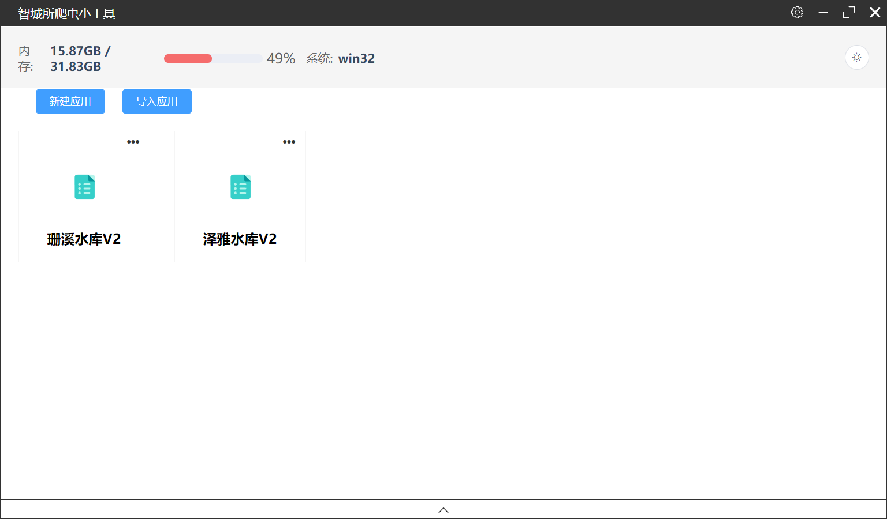
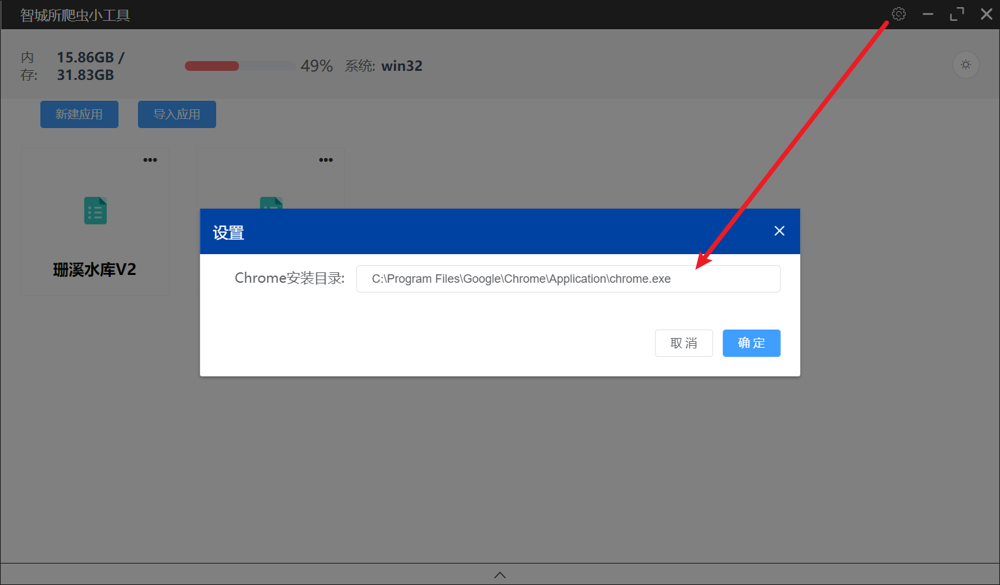
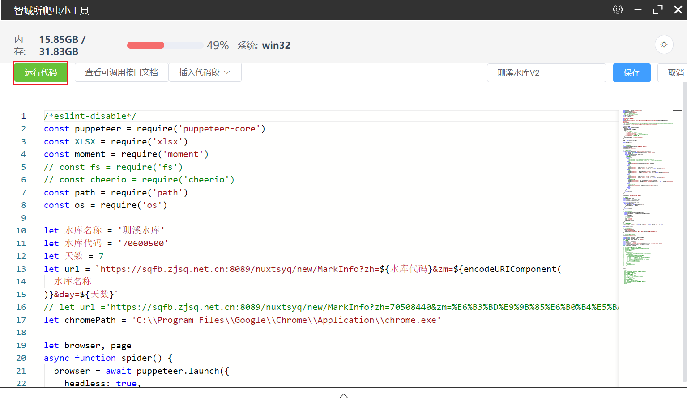
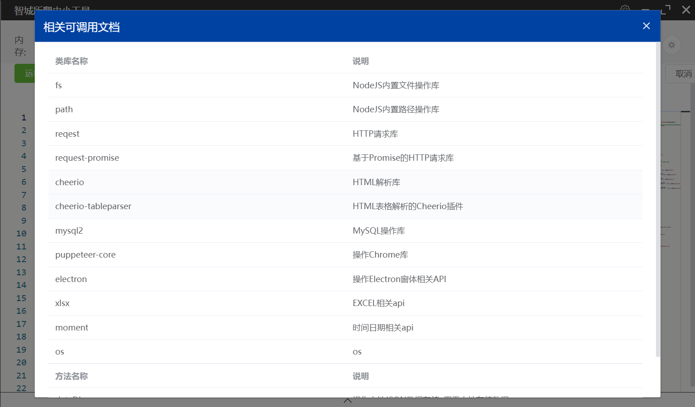

[返回](../)

# JS爬虫

前端爬虫研究

## 基于Electron的JS爬虫工具

项目地址：https://github.com/yoko-murasame/ZSpider

原始项目，基于 [Vue CLI Plugin Electron Builder](https://nklayman.github.io/vue-cli-plugin-electron-builder/guide/configuration.html#table-of-contents) 构建，但是最终的打包中，构建虚拟VM环境会有缺少依赖包的问题。

工具特点：

* 打包成了Windows可执行程序，随处运行！
* 支持自己写JS脚本
* 支持脚本的导入导出
* 内置了很多JS库提供给脚本调用

运行原理：

* 基于Electron打造的Windows程序
* 基于Puppeteer的无头浏览器，每次执行爬虫脚本相当于打开一个新的浏览器窗口，然后模拟操作，和Python、Java等原理类似
* 基于VM2的沙箱环境，每次执行脚本都是在沙箱环境中执行，不会影响到主程序

使用说明：

1）下载编译，各种坑已经被我解决了，直接clone代码编译即可

```shell
yarn && yarn build
```

2）找到`dist_electron/智城所爬虫小工具-2.0.0-win-x64.exe`，双击运行



3）配置本地的Chrome路径



4）新建脚本、导入脚本、执行脚本



5）内置的JS库



## 脚本示例：爬取NextJS开发的页面数据

运行脚本后，自动将数据导出成excel放到桌面。

```js
/*eslint-disable*/
const puppeteer = require('puppeteer-core')
const XLSX = require('xlsx')
const moment = require('moment')
// const fs = require('fs')
// const cheerio = require('cheerio')
const path = require('path')
const os = require('os')

let 水库名称 = '珊溪水库'
let 水库代码 = '70600500'
let 天数 = 7
let url = `https://sqfb.zjsq.net.cn:8089/nuxtsyq/new/MarkInfo?zh=${水库代码}&zm=${encodeURIComponent(
  水库名称
)}&day=${天数}`
// let url ='https://sqfb.zjsq.net.cn:8089/nuxtsyq/new/MarkInfo?zh=70508440&zm=%E6%B3%BD%E9%9B%85%E6%B0%B4%E5%BA%93&day=1'
let chromePath = 'C:\\Program Files\\Google\\Chrome\\Application\\chrome.exe'

let browser, page
async function spider() {
  browser = await puppeteer.launch({
    headless: true,
    executablePath: chromePath,
    args: [
      // 禁用一些功能
      '--no-sandbox', // 沙盒模式
      '--disable-setuid-sandbox', // uid沙盒
      '--disable-dev-shm-usage', // 创建临时文件共享内存
      '--disable-accelerated-2d-canvas', // canvas渲染
      '--disable-gpu', // GPU硬件加速
    ],
    ignoreDefaultArgs: ['--enable-automation'],
  })

  page = await browser.newPage()

  await page.goto(url)

  console.log('页面加载完成')

  // 使用 moment 库
  const result = moment().format('DD/MM/YYYY HH:mm:ss')
  console.log(result)
  console.log('当前日期和时间')

  // 分析dom table
  let data = await page.$$eval('tbody>.el-table__row', (rows) => {
    return rows.map((row) => {
      const columns = Array.from(row.querySelectorAll('.el-table__cell'))
      const dataObj = {}
      for (let i = 0; i < columns.length; i++) {
        const td = columns[i]
        // 填充数据
        switch (i) {
          case 0:
            // dataObj['序号'] = td.querySelector('div>div').innerText
            // dataObj['序号'] = dataObj['序号'].trim() === '-' ? null : dataObj['序号']
            break
          case 1:
            // 时间
            dataObj['record_time'] = td.querySelector('div').innerText
            break
          case 2:
            // 雨量
            dataObj['rainfall'] = td.querySelector('div').innerText
            dataObj['rainfall'] = dataObj['rainfall'].trim() === '-' ? null : dataObj['rainfall']
            break
          case 3:
            // 水位
            dataObj['waterlevel'] = td.querySelector('div>span').innerText
            dataObj['waterlevel'] = dataObj['waterlevel'].trim() === '-' ? null : dataObj['waterlevel']
            break
          case 4:
            // 库容
            dataObj['capacity'] = td.querySelector('div>span').innerText
            dataObj['capacity'] = dataObj['capacity'].trim() === '-' ? null : dataObj['capacity']
            break
          case 5:
            // 人工入库流量
            dataObj['manual_inbound'] = td.querySelector('div>span').innerText
            dataObj['manual_inbound'] = dataObj['manual_inbound'].trim() === '-' ? null : dataObj['manual_inbound']
            break
          case 6:
            // 人工出库流量
            dataObj['manual_outbound'] = td.querySelector('div>span').innerText
            dataObj['manual_outbound'] = dataObj['manual_outbound'].trim() === '-' ? null : dataObj['manual_outbound']
            break
          default:
            break
        }
      }
      return dataObj
    })
  })

  console.log(data.length)
  console.log('爬取完成，包括冗余行数量')

  // 合并数据
  const half = data.length / 2
  const firstHalf = data.slice(0, half)
  const secondHalf = data.slice(half)

  const filterEmptyKeys = (obj) => {
    const filteredObj = {}
    for (const key in obj) {
      if (obj[key] !== null && obj[key] !== '') {
        filteredObj[key] = obj[key]
      }
    }
    return filteredObj
  }

  // 合并两个数组数据
  const mergedData = firstHalf.map((item, index) => {
    const filteredFirst = filterEmptyKeys(item)
    const filteredSecond = filterEmptyKeys(secondHalf[index])
    return { 
      ...filteredFirst,
      ...filteredSecond,
      // 固定数据
      name: 水库名称,
      code: 水库代码,
      update_by: 'admin',
      update_time: result,
    }
  })
  // 过滤掉无效数据
  .filter(item => item['水位'] !== null && item['库容'] !== null && item['雨量'] !== null)

  await browser.close()

  // 格式化数据的时间
  mergedData.forEach((item) => {
    item['record_time'] =
      item['record_time'] &&
      moment(item['record_time'], 'MM-DD HH:mm').format('DD/MM/YYYY HH:mm:ss')
  })

  // console.log(mergedData)
  console.log('处理数据完成')

  // 导出数据
  const ws = XLSX.utils.json_to_sheet(mergedData)
  const wb = XLSX.utils.book_new()
  XLSX.utils.book_append_sheet(wb, ws, 'Sheet1')
  // 保存桌面
  const homedir = os.homedir();
  const desktopPath = 'desktop'
  const fileName = `${水库名称}-${水库代码}-${moment().format('YYYY-MM-DD-HHmmss')}.xlsx`
  const filePath = path.join(homedir, desktopPath, fileName)
  console.log(filePath)
  XLSX.writeFile(wb, filePath)

  // 通过对话框让用户选择导出目录和文件名
  // const path = ipcRenderer.sendSync('showSaveJsonDialog')
  // console.log('保存目录')
  // console.log(path)
  // dialog
  //   .showSaveDialog({
  //     defaultPath: `${水库名称}-${水库代码}-${result}.xlsx`,
  //   })
  //   .then((result) => {
  //     if (!result.canceled && result.filePath) {
  //       const filePath = result.filePath
  //       // const ws = XLSX.utils.json_to_sheet(mergedData)
  //       // const wb = XLSX.utils.book_new()
  //       // XLSX.utils.book_append_sheet(wb, ws, 'Sheet1')
  //       // 将工作簿写入指定的文件路径
  //       XLSX.writeFile(wb, filePath)
  //     }
  //   })
  //   .catch((err) => {
  //     console.error(err)
  //   })
}

spider()

// 路径测试
// const { remote } = require('electron')
// const desktopPath = remote.app.getPath('desktop')
// console.log(desktopPath)
// const fileName = `aaa.xlsx`
// console.log(fileName)
// const path = require('path')
// const filePath = path.join('aaa', fileName)
// console.log(filePath)
// const os = require('os');
// const homedir = os.homedir();
// console.log(homedir)
// const moment = require('moment')
// const now = moment().format('YYYY-MM-DD HH-mm-ss')
// console.log(now)
// return
```

# 归档

## 基于Cheerio的爬虫示例

* [WebCheerioCrawler](https://github.com/yoko-murasame/ant-design-vue-jeecg/blob/yoko/src/components/yoko/utils/WebCheerioCrawler.js)
* cheerio https://github.com/cheeriojs/cheerio
* `yarn add cheerio@1.0.0-rc.3`

测试发现NextJS的页面中，虽然是后端渲染的，但是数据填充还是在前端JS脚本中，而Cheerio不会产生视觉呈现，应用CSS，加载外部资源，或者执行JavaScript。因此，如果需要爬取NextJS页面，需要使用无头浏览器，如Puppeteer。

```js
import WebCheerioCrawler from '@comp/yoko/utils/WebCheerioCrawler'
function testCrawler() {
  const urls = ['https://sqfb.zjsq.net.cn:8089/nuxtsyq/new/MarkInfo?zh=70508440&zm=%E6%B3%BD%E9%9B%85%E6%B0%B4%E5%BA%93&day=1']
  const chandler = async($, crawl) => {
    const text = $.html()
    console.log('chandler', text)
    return text
  }
  const callback = (data) => {
    console.log('callback', data)
  }
  new WebCheerioCrawler(urls, chandler, callback).start();
}
```

## puppeteer使用初探

依赖：
```shell
yarn add puppeteer
#yarn add puppeteer-core
#支持webpack中的node环境
yarn add node-polyfill-webpack-plugin
```

修改`vue.config.js`：
```js
module.exports = {
  configureWebpack: {
    plugins: [
      new NodePolyfillPlugin()
    ]
  }
}
```

添加`puppeteer.config.cjs`：
```js
const {join} = require('path');

/**
 * @type {import("puppeteer").Configuration}
 */
module.exports = {
  cacheDirectory: join(__dirname, '.cache', 'puppeteer'),
};

```

测试：
```vue
<template>
  <div>
    <a-button type="primary" @click="testPuppeteer">测试Puppeteer</a-button>
  </div>
</template>
<script>
// import puppeteer from 'puppeteer'
const puppeteer = require('puppeteer')
export default {
  methods: {
    async testCrawler() {
      const urls = ['https://sqfb.zjsq.net.cn:8089/nuxtsyq/new/MarkInfo?zh=70508440&zm=%E6%B3%BD%E9%9B%85%E6%B0%B4%E5%BA%93&day=1']

      // Launch the browser and open a new blank page
      const browser = await puppeteer.launch();
      const page = await browser.newPage();

      // Navigate the page to a URL
      await page.goto(urls[0]);

      // Set screen size
      await page.setViewport({ width: 1080, height: 1024 });

      // Type into search box
      await page.type('.search-box__input', 'automate beyond recorder');

      // Wait and click on first result
      const searchResultSelector = '.search-box__link';
      await page.waitForSelector(searchResultSelector);
      await page.click(searchResultSelector);

      // Locate the full title with a unique string
      const textSelector = await page.waitForSelector(
          '#pane-ssgc > div.chartTable > div:nth-child(3) > div > div:nth-child(1) > span'
      );
      if (!textSelector) {
        const fullTitle = await textSelector.evaluate(el => el.textContent.trim());
        console.log('The title of this blog post is "%s".', fullTitle);
      }

      await browser.close();
    },
  }
}
</script>
```

# 修改历史

* 2023-08-02: 添加基于Cheerio的爬虫示例
* 2023-08-07: puppeteer使用初探
* 2023-09-07: 添加 ZSpider 使用说明
