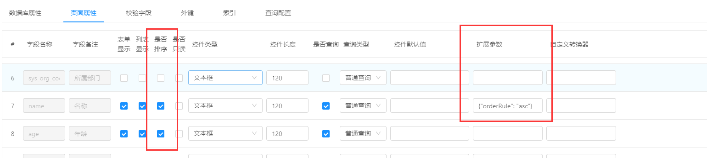

# Jeecg控件扩展参数用法

# 一、通过扩展参数限制文件上传数量

- 1.使用场景
  当online表单中需要控制文件或者图片上传数量时，可使用扩展参数来实现。
- 2.具体实现
  在online表单开发的页面属性中，当控件类型为文件或者图片时，设置扩展参数必须为json格式：

```
 {"uploadnum":1}
```

uploadnum为确定参数不可更改，uploadnum的值必须为数字(如1,2,3....)
当uploadnum值大于0时，值为几就会限制上传几个文件，
当扩展参数为空或uploadnum值等于0时，仍为多文件上传不做限制
如图：


------

# 二、通过扩展参数限制大文本在列表页面的展示长度

- 1.问题，不限制展示长度,列会被撑开很长
  
- 2.配置,页面属性 -> 扩展参数下配置
  

```
{"showLength":20}
```

- 3.效果：
  

------

# 三、通过扩展参数设置popup是否支持多选

```
version 2.4.5+
```

- 1.使用场景
  online组件popup默认是多选的，可以通过配置扩展参数实现单选控制
- 2.配置,页面属性 -> 扩展参数下配置
  

```
{"popupMulti":false}
```

- 3.效果：当选择多条数据点击确认后，提示`请选择一条记录`
  

------

# 四、通过扩展参数设置部门/用户组件 存储字段和展示字段

```
version 2.4.6+``date 20210609
```

- 1.使用场景
  部门组件默认存储部门ID,展示部门名称，用户组件默认存储用户账号，展示用户名称，现支持动态配置，指定存储/展示的字段名。
- 2.配置,页面属性 -> 扩展参数下配置
  

```
部门配置：{"store": "orgCode"}  存储字段变更为部门编码
用户配置：{"store":"id", "text":"username"} 存储字段变更为用户ID,展示字段变更为用户账号
```

- 3.备注：上述配置store为存储字段，text为展示字段，字段为部门/用户实体的字段名或数据库字段名都可以，可以只配置一个，配置的存储字段需保证数据唯一性。
  **目前只支持单表**

# 五、通过扩展参数设置部门/用户组件 是否多选

===
`version 2.4.6+``date 20210615`

- 1.使用场景
  online部门/用户组件默认是多选的，可以通过配置扩展参数实现单选控制
- 2.配置,页面属性 -> 扩展参数下配置
  

```
{"multiSelect":false}
```

------

# 六、通过扩展参数设置 查询排序规则

===
`version 2.4.6+``date 20210629`

- 1.使用场景
  online列表查询默认以id倒序排，现需要自定义默认排序字段
- 2.配置,页面属性 --> 是否排序勾选 --> 扩展参数下配置json
  

```
{"orderRule": "asc"}
```

说明：

- 如果上述配置中 "是否排序" 没有勾选，系统默认使用id倒序查询
- 如果配置了 "是否排序" ，没有填写扩展参数，系统默认使用id倒序查询，页面上可以通过点击表头切换排序规则
- 如果配置了 "是否排序" ，且填写扩展参数(`"orderRule"`为 `"asc"正序`或者`"desc"倒序`)，则系统使用配置的规则排序（**即：想要自定义默认排序，必须勾选是否排序和配置orderRule**）
- 如果配置多个字段参与默认排序，以字段顺序决定排序优先级

# 七、通过扩展参数设置 校验提示的文本信息

```
version 3.0+``date 20220217
```

- 1.使用场景
  online字段配置了校验规则，当表单校验不通过的时候，系统有个默认的提示信息，现在可以通过配置扩展参数自定义校验失败时的提示文本。
  
- 2.配置
  页面属性 --> 扩展参数下配置json
  

```
{"validateError": "这是自定义的提示信息"}
```