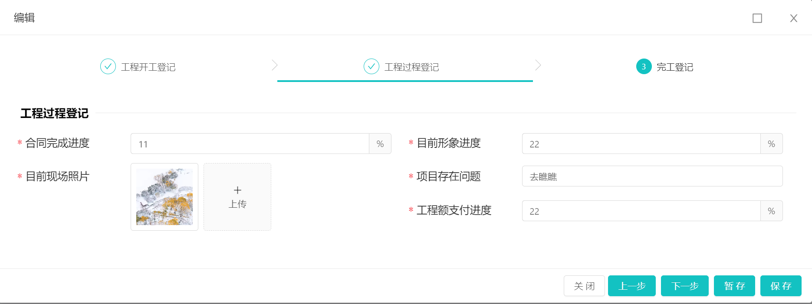

[返回](../)

# StepsTab 字典分步表单组件

组件路径: [StepsTab.vue](https://github.com/yoko-murasame/ant-design-vue-jeecg/blob/yoko/src/components/yoko/StepsTab.vue)

组件说明: 

* 可根据jeecg系统字典自动渲染步骤
* 新版-支持v-model双向绑定选中当前状态项
* 新版-支持上一步、下一步操作，调用prev()、next()方法，切换当前状态
* 新版-支持：hasPrev、hasNext，控制是否显示上一步、下一步按钮，支持.sync
* 新版-传入参数：currentTabDictValue、currentTabDictText，支持.sync
* dict传值为Boolean时，启用字典且必须传入：dictText、dictValue、dict
* dict传值为String时，将作为jeecg的系统内字典自动加载处理

TODO:

* [ ] 添加测试Demo模块

修改历史:
* 2023-12-22: 新增组件

# 使用示例:



## Modal

```vue
<template>
  <j-modal
    :title="title"
    :width="width"
    :visible="visible"
    switchFullscreen
    @ok="handleOk"
    :okButtonProps="{ class:{'jee-hidden': disableSubmit} }"
    @cancel="handleCancel"
    cancelText="关闭">
    <template v-slot:footer>
      <cancel-button :disableSubmit="disableSubmit" key="back" @click="handleCancel"/>
      <a-button type="primary" @click="$refs.realForm.prev()" v-if="!disableSubmit && hasPrev" :disabled="!hasPrev">上一步</a-button>
      <a-button type="primary" @click="$refs.realForm.next()" v-if="!disableSubmit && hasNext" :disabled="!hasNext">下一步</a-button>
      <a-button type="primary" @click="handleOk(1)" v-if="!disableSubmit && temporarilySave">暂存</a-button>
      <a-button type="primary" @click="handleOk(2)" v-if="!disableSubmit && formalSave">保存</a-button>
      <!--<a-button type="primary" @click="handleOk(3)" v-if="!disableSubmit && submitProcess">提交</a-button>-->
      <!--<a-button type="primary" @click="handleOk(2)" v-if="!disableSubmit && !temporarilySave && !formalSave && !submitProcess">提交</a-button>-->
    </template>
    <ztb-xedj-form
      ref="realForm"
      @ok="submitCallback"
      @autoSubmitProcess="autoSubmitProcess"
      :disabled="disableSubmit"
      :view-mode="disableSubmit"
      @update:hasPrev="e => hasPrev = e"
      @update:hasNext="e => hasNext = e"
    ></ztb-xedj-form>
  </j-modal>
</template>

<script>
import ZtbXedjForm from './ZtbXedjForm'
import CancelButton from '@views/modules/bpm/mytask/utils/CancelButton.vue'

export default {
  name: 'ZtbXedjModal',
  components: {
    CancelButton,
    ZtbXedjForm
  },
  props: {
    // 暂存
    temporarilySave: {
      type: [Boolean, String],
      default: false
    },
    // 保存
    formalSave: {
      type: [Boolean, String],
      default: true
    },
    // 提交流程
    submitProcess: {
      type: [Boolean, String],
      default: false
    }
  },
  data () {
    return {
      title: '',
      width: 1250,
      visible: false,
      disableSubmit: false,
      hasPrev: false,
      hasNext: true
    }
  },
  methods: {
    add () {
      this.visible = true
      this.$nextTick(() => {
        this.$refs.realForm.add();
      })
    },
    edit (record) {
      this.visible = true
      this.$nextTick(() => {
        this.$refs.realForm.edit(record);
      })
    },
    close () {
      this.$emit('close');
      this.visible = false;
    },
    /**
     * 1 暂存 忽略校验
     * 2 保存 校验必填
     * 3 提交 校验必填&自动发起流程
     * @param type
     */
    handleOk (type) {
      this.$refs.realForm.submitForm(type);
    },
    autoSubmitProcess(record) {
      if (!record && !record.id) {
        this.$message.warning('保存接口未返回数据项id,流程自动提交失败!');
      } else if (record.bpmStatus === '2') {
        this.$message.info('流程已发起')
      } else if (record.bpmStatus === '3') {
        this.$message.info('流程已完成')
      } else {
        this.$emit('autoSubmitProcess', record);
      }
    },
    submitCallback() {
      this.$emit('ok');
      this.visible = false;
    },
    handleCancel () {
      this.close()
    }
  }
}
</script>

```

## form

```vue
<template>
  <a-spin :spinning="confirmLoading">
    <j-form-container :disabled="formDisabled">
      <a-form :form="form" slot="detail" :class="{'view-mode': viewMode}">
        <a-form-item>
          <steps-tab
            ref="stepsTab"
            :debug="false"
            style="margin-bottom: 2vh"
            :dict="stateDict"
            v-decorator="['currentState', validatorRules.currentState]"
            :current-tab-dict-text.sync="currentTabName"
            :current-tab-dict-value.sync="currentTab"
            :current-finish="currentFinish"
            @update:hasPrev="e => $emit('update:hasPrev', e)"
            @update:hasNext="e => $emit('update:hasNext', e)"
            @stateChange="switchRequired"
          ></steps-tab>
        </a-form-item>
        <a-divider class="my-divider">{{ currentTabName }}</a-divider>
        <a-row>
          <div v-show="currentTab === '1'">
            <a-col :span="12">
              <a-form-item label="工程项目名称" :labelCol="labelCol2" :wrapperCol="wrapperCol2">
                <a-input v-decorator="['gcxmmc', validatorRules.gcxmmc]" placeholder="请输入工程项目名称" ></a-input>
              </a-form-item>
            </a-col>
            <a-col :span="12">
              <a-form-item label="工程合同金额" :labelCol="labelCol2" :wrapperCol="wrapperCol2">
                <a-input v-decorator="['gchtje', validatorRules.gchtje]" placeholder="请输入工程合同金额" style="width: 100%">
                  <template v-slot:addonAfter>
                    万元
                  </template>
                </a-input>
              </a-form-item>
            </a-col>
            <a-col :span="12">
              <a-form-item label="工程项目负责人" :labelCol="labelCol2" :wrapperCol="wrapperCol2">
                <a-input v-decorator="['gcxmfzr', validatorRules.gcxmfzr]" placeholder="请输入工程项目负责人" ></a-input>
              </a-form-item>
            </a-col>
            <a-col :span="12">
              <a-form-item label="发包方式" :labelCol="labelCol2" :wrapperCol="wrapperCol2">
                <j-dict-select-tag
                  type="list"
                  v-decorator="['fbfs', validatorRules.fbfs]"
                  :trigger-change="true"
                  dictCode="fb_way"
                  placeholder="请选择发包方式"
                />
              </a-form-item>
            </a-col>
            <a-col :span="12">
              <a-form-item label="施工单位" :labelCol="labelCol2" :wrapperCol="wrapperCol2">
                <a-input v-decorator="['sgdw', validatorRules.sgdw]" placeholder="请输入施工单位" ></a-input>
              </a-form-item>
            </a-col>
            <a-col :span="12">
              <a-form-item label="实际开工时间" :labelCol="labelCol2" :wrapperCol="wrapperCol2">
                <j-date placeholder="请选择实际开工时间" v-decorator="['sjkgsj', validatorRules.sjkgsj]" :trigger-change="true" style="width: 100%" />
              </a-form-item>
            </a-col>
            <a-col :span="12">
              <a-form-item label="工程内容" :labelCol="labelCol2" :wrapperCol="wrapperCol2">
                <a-textarea
                  :auto-size="{ minRows: 3, maxRows: 5 }"
                  v-decorator="['gcnr', validatorRules.gcnr]"
                  placeholder="请输入工程内容"></a-textarea>
              </a-form-item>
            </a-col>
          </div>
          <div v-show="currentTab === '2'">
            <a-col :span="12">
              <a-form-item label="合同完成进度" :labelCol="labelCol2" :wrapperCol="wrapperCol2">
                <a-input
                  :min="0"
                  :max="100"
                  :precision="2"
                  v-decorator="['htwcjd', validatorRules.htwcjd]"
                  placeholder="请输入合同完成进度"
                  style="width: 100%" >
                  <template v-slot:addonAfter>
                    %
                  </template>
                </a-input>
              </a-form-item>
            </a-col>
            <a-col :span="12">
              <a-form-item label="目前形象进度" :labelCol="labelCol2" :wrapperCol="wrapperCol2">
                <a-input
                  :min="0"
                  :max="100"
                  :precision="2"
                  v-decorator="['mqxxjd', validatorRules.mqxxjd]"
                  placeholder="请输入目前形象进度"
                  style="width: 100%" >
                  <template v-slot:addonAfter>
                    %
                  </template>
                </a-input>
              </a-form-item>
            </a-col>
            <a-col :span="12">
              <a-form-item label="目前现场照片" :labelCol="labelCol2" :wrapperCol="wrapperCol2">
                <j-upload
                  bizPath="ztb/xedj"
                  :disabled="disabled"
                  :trigger-change="true"
                  file-type="image"
                  v-decorator="['mqxczp', validatorRules.mqxczp]"
                  text="上传"
                  :number="10"
                  :returnUrl="true"
                ></j-upload>
              </a-form-item>
            </a-col>
            <a-col :span="12">
              <a-form-item label="项目存在问题" :labelCol="labelCol2" :wrapperCol="wrapperCol2">
                <a-input v-decorator="['xmczwt', validatorRules.xmczwt]" placeholder="请输入项目存在问题" ></a-input>
              </a-form-item>
            </a-col>
            <a-col :span="12">
              <a-form-item label="工程额支付进度" :labelCol="labelCol2" :wrapperCol="wrapperCol2">
                <a-input
                  :min="0"
                  :max="100"
                  :precision="2"
                  v-decorator="['gcezfjd', validatorRules.gcezfjd]"
                  placeholder="请输入工程额支付进度"
                  style="width: 100%" >
                  <template v-slot:addonAfter>
                    %
                  </template>
                </a-input>
              </a-form-item>
            </a-col>
          </div>
          <div v-show="currentTab === '3'">
            <a-col :span="24">
              <a-form-item label="验收时间" :labelCol="labelCol" :wrapperCol="wrapperCol">
                <j-date placeholder="请选择验收时间" v-decorator="['yssj', validatorRules.yssj]" :trigger-change="true" style="width: 100%" />
              </a-form-item>
            </a-col>
            <a-col :span="24">
              <a-form-item label="完工验收材料" :labelCol="labelCol" :wrapperCol="wrapperCol">
                <j-upload
                  bizPath="ztb/xedj"
                  :disabled="disabled"
                  :trigger-change="true"
                  file-type="all"
                  v-decorator="['wgyscl', validatorRules.wgyscl]"
                  text="上传附件"
                  :number="10"
                  :returnUrl="true"
                ></j-upload>
              </a-form-item>
            </a-col>
            <a-col :span="24">
              <a-form-item label="完工照片" :labelCol="labelCol" :wrapperCol="wrapperCol">
                <j-upload
                  bizPath="ztb/xedj"
                  :disabled="disabled"
                  :trigger-change="true"
                  file-type="image"
                  v-decorator="['wgzp', validatorRules.wgzp]"
                  text="上传"
                  :number="10"
                  :returnUrl="true"
                ></j-upload>
              </a-form-item>
            </a-col>
            <a-col :span="24">
              <a-form-item label="结算资料" :labelCol="labelCol" :wrapperCol="wrapperCol">
                <j-upload
                  bizPath="ztb/xedj"
                  :disabled="disabled"
                  :trigger-change="true"
                  file-type="all"
                  v-decorator="['jszl', validatorRules.jszl]"
                  text="上传附件"
                  :number="10"
                  :returnUrl="true"
                ></j-upload>
              </a-form-item>
            </a-col>
            <a-col :span="24">
              <a-form-item label="其他附件" :labelCol="labelCol" :wrapperCol="wrapperCol">
                <j-upload
                  bizPath="ztb/xedj"
                  :disabled="disabled"
                  :trigger-change="true"
                  file-type="all"
                  v-decorator="['qtfj', validatorRules.qtfj]"
                  text="上传附件"
                  :number="10"
                  :returnUrl="true"
                ></j-upload>
              </a-form-item>
            </a-col>
            <a-col v-if="showFlowSubmitButton" :span="24" style="text-align: center">
              <a-button @click="submitForm">保 存</a-button>
            </a-col>
          </div>
        </a-row>
      </a-form>
    </j-form-container>
  </a-spin>
</template>

<script>

import { getAction, httpAction } from '@/api/manage'
import pick from 'lodash.pick'
import { debounce, union } from 'lodash'
import StepsTab from '@views/modules/bpm/mytask/utils/StepsTab'

export default {
  name: 'ZtbXedjForm',
  components: {
    StepsTab
  },
  props: {
    // 流程表单data
    formData: {
      type: Object,
      default: () => {},
      required: false
    },
    // 表单模式：true流程表单 false普通表单
    formBpm: {
      type: Boolean,
      default: false,
      required: false
    },
    // 表单禁用
    disabled: {
      type: Boolean,
      default: false,
      required: false
    },
    // 展示模式
    viewMode: {
      type: [Boolean, String],
      default: false,
      required: false
    }
  },
  data () {
    return {
      form: this.$form.createForm(this),
      model: {},
      labelCol: {
        xs: { span: 24 },
        sm: { span: 3 }
      },
      wrapperCol: {
        xs: { span: 24 },
        sm: { span: 20 }
      },
      labelCol2: {
        xs: { span: 24 },
        sm: { span: 6 }
      },
      wrapperCol2: {
        xs: { span: 24 },
        sm: { span: 16 }
      },
      confirmLoading: false,
      validatorRules: {
        currentState: {
          rules: [
            { required: false, message: '当前状态!' }
          ]
        },
        gcxmmc: {
          rules: [
            { required: true, message: '请输入项目名称!' },
            { validator: debounce(this.judgeExist, 1000) }
          ]
        },
        gchtje: {
          rules: [
            { required: true, message: '请输入工程合同金额!' },
            { pattern: new RegExp('^-?\\d+\\.?\\d*$'), message: '请输入正确的金额!' }
          ]
        },
        gcxmfzr: {
          rules: [
            { required: true, message: '请输入工程项目负责人!' }
          ]
        },
        fbfs: {
          rules: [
            { required: true, message: '请选择发包方式!' }
          ]
        },
        sgdw: {
          rules: [
            { required: true, message: '请输入施工单位!' }
          ]
        },
        sjkgsj: {
          rules: [
            { required: true, message: '请选择实际开工时间!' }
          ]
        },
        gcnr: {
          rules: [
            { required: true, message: '请输入工程内容!' }
          ]
        },
        htwcjd: {
          rules: [
            { required: true, message: '请输入合同完成进度!' },
            { pattern: new RegExp('^-?\\d+\\.?\\d*$'), message: '请输入数字!' }
          ]
        },
        mqxxjd: {
          rules: [
            { required: true, message: '请输入目前形象进度!' },
            { pattern: new RegExp('^-?\\d+\\.?\\d*$'), message: '请输入数字!' }
          ]
        },
        mqxczp: {
          rules: [
            { required: true, message: '请上传现场照片!' }
          ]
        },
        xmczwt: {
          rules: [
            { required: true, message: '请输入项目存在问题!' }
          ]
        },
        gcezfjd: {
          rules: [
            { required: true, message: '请输入工程额支付进度!' },
            { pattern: new RegExp('^-?\\d+\\.?\\d*$'), message: '请输入数字!' }
          ]
        },
        yssj: {
          rules: [
            { required: true, message: '请选择验收时间!' }
          ]
        },
        wgyscl: {
          rules: [
            { required: true, message: '请上传完工验收材料!' }
          ]
        },
        wgzp: {
          rules: [
            { required: true, message: '请上传完工照片!' }
          ]
        },
        jszl: {
          rules: [
            { required: true, message: '请上传结算资料!' }
          ]
        },
        qtfj: {
          rules: [
            { required: false, message: '请上传其他附件!' }
          ]
        }
      },
      url: {
        add: '/ztb/ztbXedj/add',
        edit: '/ztb/ztbXedj/edit',
        queryById: '/ztb/ztbXedj/queryById'
      },
      // 仅控制当前tab
      currentTab: '',
      currentTabName: '',
      currentFinish: false
    }
  },
  computed: {
    formDisabled() {
      if (this.formBpm === true) {
        if (this.formData.disabled === false) {
          return false
        }
        return true
      }
      return this.disabled
    },
    showFlowSubmitButton() {
      if (this.formBpm === true) {
        if (this.formData.disabled === false) {
          return true
        }
      }
      return false
    },
    stateDict() {
      return 'ztb_xedj_state'
    },
    /**
     * 不同分步下的表单必填字段
     * @returns {string[][]}
     */
    stepsFields() {
      return [
        ['gcxmmc', 'gchtje', 'gcxmfzr', 'fbfs', 'sgdw', 'sjkgsj', 'gcnr'],
        ['htwcjd', 'mqxxjd', 'mqxczp', 'xmczwt', 'gcezfjd'],
        ['yssj', 'wgyscl', 'wgzp', 'jszl']
      ]
    }
  },
  created () {
    // 如果是流程中表单，则需要加载流程表单data
    this.showFlowData();
  },
  methods: {
    /**
     * 当前节点完成状态
     * 触发点：
     * 1.下一步前校验表单-阻塞操作
     * 2.表单首次渲染-更新填写状态（表单必填项全填后设置成✔）
     */
    async updateCurrentState() {
      await this.$nextTick()
      return new Promise((resolve) => {
        // 通过校验当前必填去判断是否节点完成
        this.form.validateFieldsAndScroll({ force: true }, (err, values) => {
          console.log('validate', err, values)
          if (!err) {
            this.currentFinish = true
            resolve(true)
          } else {
            this.currentFinish = false
            this.currentTab = this.form.getFieldValue('currentState')
            resolve(false)
          }
        })
      })
    },
    async prev() {
      // const flag = await this.updateCurrentState()
      // flag && this.$refs.stepsTab.prev()
      this.$refs.stepsTab.prev()
    },
    async next() {
      const flag = await this.updateCurrentState()
      flag && this.$refs.stepsTab.next()
      // 从切换到下一步后，需要将填写完成状态设置回去
      this.currentFinish = false
    },
    /**
     * 切换不同状态下的必填表单项
     * @param state
     */
    switchRequired({ index }) {
      console.log('switchRequired', index)
      Object.keys(this.validatorRules).forEach(field => (this.validatorRules[field].rules[0].required = false))
      this.stepsFields.reduce((pre, cur, idx) => idx <= index ? union(pre, cur) : pre, []).forEach(field => (this.validatorRules[field].rules[0].required = true))
    },
    judgeExist(rule, value, cb) {
      const that = this
      !value && cb()
      // 排除编辑时指向自己
      if (value === that.model.gcxmmc) {
        cb()
      }
      // 请求接口验证
      getAction('/ztb/ztbXedj/list', { gcxmmc: value })
        .then(res => {
          if (res.success && !res.result.total) {
            cb()
          } else {
            const exist = res.result.records.filter(item => item.gcxmmc === value).length
            exist && cb(new Error('项目名称已重复'))
            !exist && cb()
          }
        })
    },
    /**
     * 初始化各种值
     * @param record
     */
    installValue(record) {
      // 控制分步tab组件，这里的默认值1为字典的实际值
      record.currentState = record.currentState || '1'
      this.currentTab = record.currentState
    },
    add () {
      this.edit({ currentState: '1' });
    },
    edit (record) {
      this.form.resetFields();
      this.model = Object.assign({}, record);
      this.visible = true;
      this.installValue(record)
      this.$nextTick(() => {
        this.renderForm()
        // 第一次新增时，不触发填写状态更新
        record.id && this.updateCurrentState()
      })
    },
    renderForm() {
      this.$nextTick(() => {
        this.form.setFieldsValue(pick(this.model, 'currentState', 'gcxmmc', 'gchtje', 'gcxmfzr', 'fbfs', 'sgdw', 'sjkgsj', 'gcnr', 'htwcjd', 'mqxxjd', 'mqxczp', 'xmczwt', 'gcezfjd', 'yssj', 'wgyscl', 'wgzp', 'jszl', 'qtfj'))
      })
    },
    // 渲染流程表单数据
    showFlowData() {
      if (this.formBpm === true) {
        let params = { id: this.formData.dataId };
        getAction(this.url.queryById, params).then((res) => {
          if (res.success) {
            this.edit(res.result);
          }
        });
      }
    },
    /**
     * 1 暂存 忽略校验
     * 2 保存 校验必填
     * 3 提交 校验必填&自动发起流程
     * @param type
     */
    submitForm (type = 2) {
      const that = this;
      // 触发表单验证
      return new Promise((resolve, reject) => {
        that.form.validateFieldsAndScroll({ force: true }, (err, values) => {
          if (!err || type === 1) {
            that.confirmLoading = true;
            let httpurl = '';
            let method = '';
            if (!that.model.id) {
              httpurl += that.url.add;
              method = 'post';
            } else {
              httpurl += that.url.edit;
              method = 'put';
            }
            let formData = Object.assign(that.model, values);
            console.log('表单提交数据', formData);
            httpAction(httpurl, formData, method).then((res) => {
              if (res.success) {
                that.$message.success(res.message);
                if (type === 3) {
                  that.$emit('autoSubmitProcess', res.result);
                }
                that.$emit('ok');
                resolve(true)
              } else {
                that.$message.warning(res.message);
                reject()
              }
            }).finally(() => {
              that.confirmLoading = false;
            });
          } else {
            reject()
          }
        })
      })
    },
    popupCallback(row) {
      this.form.setFieldsValue(pick(row, 'currentState', 'gcxmmc', 'gchtje', 'gcxmfzr', 'fbfs', 'sgdw', 'sjkgsj', 'gcnr', 'htwcjd', 'mqxxjd', 'mqxczp', 'xmczwt', 'gcezfjd', 'yssj', 'wgyscl', 'wgzp', 'jszl', 'qtfj'))
    }
  }
}
</script>
<style lang="less" scoped>
@import '~@assets/less/common.less';
@import '~@assets/less/form-common.less';
/deep/ .my-divider.ant-divider-horizontal.ant-divider-with-text-center {
  color: #000000;
  margin: 0;
  text-align: left;
  font-weight: bold;
  .ant-divider-inner-text {
    display: inline-block;
    padding: 0 0.5vw;
    font-size: 1.5vh;
  }
  &::before, &::after {
    border-top: 0.2vh solid rgb(0 0 0 / 5%);
  }
  &::before {
    width: 0;
  }
  &::after {
    width: 90%;
  }
}
</style>

```


# 归档

## 旧版本-使用dict的选中值作为v-model值

使用：

```vue
<steps-tab
  ref="stepsTab"
  :debug="false"
  style="margin-bottom: 2vh"
  :dict="stateDict"
  v-model="currentTab"
  :current-tab-dict-text.sync="currentTabName"
  :current-state.sync="validatorRules.currentState.modelValue"
  :current-finish="validatorRules.currentState.currentFinish"
  @update:hasPrev="e => $emit('update:hasPrev', e)"
  @update:hasNext="e => $emit('update:hasNext', e)"
  @stateChange="switchRequired"
></steps-tab>
```

代码：

```vue
<template>
  <a-steps v-if="dictLoad" v-model="currentTabDictValueIndex" type="navigation" size="small">
    <a-step v-for="step in stepItems" :key="step.title" :status="step.status" :title="step.title" :disabled="step.disabled" />
  </a-steps>
</template>

<script>
/**
 * 动态的分布表单展示组件封装
 * @author yoko
 * 可根据jeecg系统字典自动渲染步骤
 * 支持v-model双向绑定选中tab项
 * dict传值为Boolean时，启用字典且必须传入：dictText、dictValue、dict
 * dict传值为String时，将作为jeecg的系统内字典自动加载处理
 */
import { initDictOptions } from '@comp/dict/JDictSelectUtil';

export default {
  name: 'StepsTab',
  model: {
    prop: 'currentTabDictValue',
    event: 'change'
  },
  props: {
    /**
     * 当前节点(.sync同步|@update:currentState)
     * 这个值的类型和currentTabDictValue相同，即需要传入dict字典的value值
     * 作用：在非debug模式下，用户无法点击这个节点后的步骤
     */
    currentState: {
      type: String,
      default: '测试2'
    },
    currentFinish: {
      type: [Boolean, String],
      default: false
    },
    /**
     * 当前选中tab(v-model)
     * 这里的值是传入dict字典的value值
     */
    currentTabDictValue: {
      type: String,
      default: '测试2'
    },
    /**
     * 当前选中tab的字典翻译(.sync同步|@update:currentTabDictText)
     */
    currentTabDictText: {
      type: String,
      default: ''
    },
    /**
     * 静态字典文本数组，同tab的title
     */
    dictText: {
      type: Array,
      default: () => ['测试1', '测试2', '测试3']
    },
    /**
     * 静态字典值数组
     */
    dictValue: {
      type: Array,
      default: () => ['1', '2', '3']
    },
    /**
     * 字典模式
     * Boolean - false 时需传入 dictText dictValue
     * String - '字典code' 时默认去加载系统字典
     */
    dict: {
      type: [Boolean, String],
      default: false
    },
    /**
     * tab改变前的钩子，一定需要触发cb()
     */
    beforeChange: {
      type: Function,
      default: (before, after, cb) => cb()
    },
    /**
     * 调试模式(控制是否可以点击非当前步骤的后续step)
     */
    debug: {
      type: [Boolean, String],
      default: false
    },
    /**
     * 是否有下一步(.sync同步|@update:hasNext)
     */
    hasNext: {
      type: [Boolean, String],
      default: true
    },
    /**
     * 是否有上一步(.sync同步|@update:hasPrev)
     */
    hasPrev: {
      type: [Boolean, String],
      default: true
    }
  },
  data() {
    return {
      // 内部的是实际dict字典值对应的数组index
      currentTabDictValueIndex: 0,
      dictOptions: null,
      dictValueInner: [],
      dictTextInner: [],
      dictLoad: false
    }
  },
  computed: {
    transferCurrentTabDictValue() {
      if (!this.dictLoad) {
        return ''
      }
      return this.dict ? this.dictTextInner[this.dictValueInner.indexOf(this.currentTabDictValue)] : this.currentTabDictValue
    },
    transferCurrentState() {
      if (!this.dictLoad) {
        return ''
      }
      return this.dict ? this.dictTextInner[this.dictValueInner.indexOf(this.currentState)] : this.currentState
    },
    stepItems() {
      if (!this.dictLoad) {
        return []
      }
      const curIdx = this.dictTextInner.indexOf(this.transferCurrentState) || 0;
      return this.dictTextInner.map((text, idx) => {
        return {
          title: text,
          status: curIdx === idx ? this.currentFinish ? 'finish' : 'process' : curIdx < idx ? 'wait' : 'finish',
          disabled: this.debug ? false : (curIdx < idx)
        }
      })
    }
  },
  watch: {
    dict(v) {
      console.log('字典改变了', v, this.currentTabDictValue, this.currentTabDictValueIndex)
      this.dictLoad = false
      this.$nextTick(() => this.initialDict())
    },
    /**
     * 需要监听转换后的字典值（当前默认tab）
     * 可以做到 切换字典时自动切换默认选中tab
     */
    transferCurrentTabDictValue: {
      immediate: true,
      handler(val) {
        if (!val) {
          return
        }
        this.currentTabDictValueIndex = this.dictTextInner.indexOf(val || this.transferCurrentState) || 0;
        console.log('transferCurrentTabDictValue change', this.transferCurrentTabDictValue)
      }
    },
    /**
     * 这个方式做不到 切换字典时自动切换默认选中tab
     */
    // currentTabDictValue: {
    //   immediate: true,
    //   handler() {
    //     if (!this.dictLoad) {
    //       return
    //     }
    //     this.currentTabDictValueIndex = this.dictTextInner.indexOf(this.transferCurrentTabDictValue || this.transferCurrentState) || 0;
    //     console.log('currentTabDictValue change', this.transferCurrentTabDictValue, this.transferCurrentState, this.currentTabDictValueIndex)
    //   }
    // },
    /**
     * 双向绑定内部steps组件和外部值
     */
    currentTabDictValueIndex(idx, old) {
      const cb = (err) => {
        if (err) {
          console.error('错误触发了 ', err)
          return
        }
        this.$emit('change', this.dict ? this.dictValueInner[idx] : this.dictTextInner[idx]);
        this.$emit('update:currentTabDictText', this.dictTextInner[idx])
        console.log('currentTabDictValueIndex change', this.dictTextInner[idx], this.dictValueInner[idx])
        this.updateHasNextPrev()
      };
      this.beforeChange(this.dictValueInner[old], this.dictValueInner[idx], cb)
    },
    /**
     * 监听state值变化
     */
    transferCurrentState(val) {
      if (!val) {
        return
      }
      const args = {
        dictCode: this.dict,
        dictOptions: this.dictOptions,
        dictValue: this.dictValueInner,
        dictText: this.dictTextInner,
        text: this.transferCurrentState || this.dictTextInner[0],
        value: this.currentState || this.dictValueInner[0],
        index: this.dictValueInner.indexOf(this.currentState || this.dictValueInner[0])
      };
      console.log('transferCurrentState change', val, args)
      this.$emit('stateChange', args)
    }
  },
  async created() {
    await this.initialDict()
  },
  methods: {
    updateHasNextPrev() {
      console.log('updateHasNextPrev', this.currentTabDictValueIndex + 1 < this.dictValueInner.length, this.currentTabDictValueIndex > 0)
      this.$emit('update:hasNext', this.currentTabDictValueIndex + 1 < this.dictValueInner.length)
      this.$emit('update:hasPrev', this.currentTabDictValueIndex > 0)
    },
    /**
     * 上一步
     */
    prev() {
      if (!this.hasPrev) {
        return
      }
      this.currentTabDictValueIndex--
      this.$emit('update:currentState', this.dictValueInner[this.currentTabDictValueIndex])
    },
    /**
     * 下一步
     */
    next() {
      if (!this.hasNext) {
        return
      }
      this.currentTabDictValueIndex++
      this.$emit('update:currentState', this.dictValueInner[this.currentTabDictValueIndex])
    },
    /**
     * 初始化字典
     * @returns {Promise<void>}
     */
    async initialDict() {
      if (typeof this.dict === 'string') {
        const { result } = await initDictOptions(this.dict)
        this.dictOptions = result
        this.dictValueInner = result.map(e => e.value)
        this.dictTextInner = result.map(e => e.text)
      } else {
        if (this.dict && this.dictValue.length !== this.dictText.length) {
          throw new Error('字典模式下,请确保dictValue、dictText数量一致!')
        }
        this.dictValueInner = [...this.dictValue]
        this.dictTextInner = [...this.dictText]
      }
      // 触发computed缓存刷新
      this.dictLoad = true
      console.log('字典初始化完成', this.dictValueInner, this.dictTextInner, this.dictOptions)
    }
  }
}
</script>

```

# END
