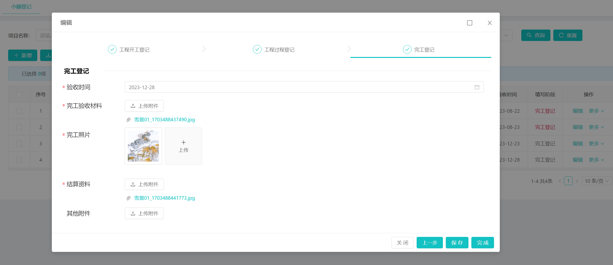

[返回](../)

# StepsTab 字典分步表单组件

组件路径: [StepsTab.vue](https://github.com/yoko-murasame/ant-design-vue-jeecg/blob/yoko/src/components/yoko/StepsTab.vue)

组件说明: 

* 可根据jeecg系统字典自动渲染步骤
* 新版-支持v-model双向绑定选中当前状态项
* 新版-支持上一步、下一步操作，调用prev()、next()方法，切换当前状态
* 新版-支持：hasPrev、hasNext，控制是否显示上一步、下一步按钮，支持.sync
* 新版-传入参数：currentTabDictValue、currentTabDictText，支持.sync
* dict传值为Boolean时，启用字典且必须传入：dictText、dictValue、dict
* dict传值为String时，将作为jeecg的系统内字典自动加载处理
* 动态表单项示例

修改历史:
* 2023-12-22: 新增组件
* 2023-12-25: 添加测试Demo模块

# 分步表单+动态表单项示例模块:

* [SQL路径](https://github.com/yoko-murasame/jeecg-boot/blob/yoko-3.4.3last/db/PostgreSQL/可选/ztb_xedj.sql)
* [后端路径](https://github.com/yoko-murasame/jeecg-boot/blob/yoko-3.4.3last/jeecg-module-system/jeecg-system-start/src/main/java/org/jeecg/modules/ztb)
* [前端路径](https://github.com/yoko-murasame/ant-design-vue-jeecg/blob/yoko/src/views/modules/ztb)



1）执行SQL脚本

2）路由配置

```json
{
  "name": "分步表单和动态表单",
  "path": "/stepsTab",
  "module": "modules/ztb/ZtbXedjList"
}
```


## 使用

```vue
<!--当前状态和分步按钮选项两个数据分离情况，具体使用请参考组件：ZtbXedjForm.vue-->
<a-form-item class="step-form-item">
  <steps-tab
      ref="stepsTab"
      :debug="false"
      style="margin-bottom: 2vh"
      :dict="stateDict"
      v-decorator="['currentState', validatorRules.currentState]"
      :current-tab-dict-text.sync="currentTabName"
      :current-tab-dict-value.sync="currentTab"
      :current-finish="currentFinish"
      @update:hasPrev="e => $emit('update:hasPrev', e)"
      @update:hasNext="e => $emit('update:hasNext', e)"
      @stateChange="switchRequired"
  ></steps-tab>
</a-form-item>
<!--当前状态和分步按钮选项两个数据分离情况，使用自定义字典，具体使用请参考组件：ZtbXedjForm.vue-->
<a-form-item class="step-form-item">
  <steps-tab
      ref="stepsTab"
      :debug="false"
      :dict="true"
      :dict-text="['基本信息', '预警等级', '短信']"
      :dict-value="['1', '2', '3']"
      v-decorator="['warningStatus']"
      :current-finish="currentFinish"
      :current-tab-dict-value.sync="currentTab"
      @update:hasPrev="e => $emit('update:hasPrev', e)"
      @update:hasNext="e => $emit('update:hasNext', e)"
      @stateChange="switchRequired"
  ></steps-tab>
</a-form-item>
```

# 归档

## 使用方式@20240824旧版本归档

```vue
<!--当前状态和分步按钮选项两个数据分离情况-->
<steps-tab
  ref="stepsTab"
  :debug="false"
  style="margin-bottom: 2vh"
  :dict="stateDict"
  v-model="currentTab"
  :current-tab-dict-text.sync="currentTabName"
  :current-state.sync="validatorRules.currentState.modelValue"
  :current-finish="validatorRules.currentState.currentFinish"
  @update:hasPrev="e => $emit('update:hasPrev', e)"
  @update:hasNext="e => $emit('update:hasNext', e)"
  @stateChange="switchRequired"
></steps-tab>
<!--当前状态和选项表现一致的情况-->
<steps-tab
  :debug="true"
  dict="excavation_type_object_state"
  v-decorator="['currentState']"
  :current-finish="true"
  :current-tab-dict-value.sync="model.currentState"
  @update:currentTabDictValue="e => form.setFieldsValue({'currentState': e})"
></steps-tab>
```

## 旧版本-使用dict的选中值作为v-model值

代码：

```vue
<template>
  <a-steps v-if="dictLoad" v-model="currentTabDictValueIndex" type="navigation" size="small">
    <a-step v-for="step in stepItems" :key="step.title" :status="step.status" :title="step.title" :disabled="step.disabled" />
  </a-steps>
</template>

<script>
/**
 * 动态的分布表单展示组件封装
 * @author yoko
 * 可根据jeecg系统字典自动渲染步骤
 * 支持v-model双向绑定选中tab项
 * dict传值为Boolean时，启用字典且必须传入：dictText、dictValue、dict
 * dict传值为String时，将作为jeecg的系统内字典自动加载处理
 */
import { initDictOptions } from '@comp/dict/JDictSelectUtil';

export default {
  name: 'StepsTab',
  model: {
    prop: 'currentTabDictValue',
    event: 'change'
  },
  props: {
    /**
     * 当前节点(.sync同步|@update:currentState)
     * 这个值的类型和currentTabDictValue相同，即需要传入dict字典的value值
     * 作用：在非debug模式下，用户无法点击这个节点后的步骤
     */
    currentState: {
      type: String,
      default: '测试2'
    },
    currentFinish: {
      type: [Boolean, String],
      default: false
    },
    /**
     * 当前选中tab(v-model)
     * 这里的值是传入dict字典的value值
     */
    currentTabDictValue: {
      type: String,
      default: '测试2'
    },
    /**
     * 当前选中tab的字典翻译(.sync同步|@update:currentTabDictText)
     */
    currentTabDictText: {
      type: String,
      default: ''
    },
    /**
     * 静态字典文本数组，同tab的title
     */
    dictText: {
      type: Array,
      default: () => ['测试1', '测试2', '测试3']
    },
    /**
     * 静态字典值数组
     */
    dictValue: {
      type: Array,
      default: () => ['1', '2', '3']
    },
    /**
     * 字典模式
     * Boolean - false 时需传入 dictText dictValue
     * String - '字典code' 时默认去加载系统字典
     */
    dict: {
      type: [Boolean, String],
      default: false
    },
    /**
     * tab改变前的钩子，一定需要触发cb()
     */
    beforeChange: {
      type: Function,
      default: (before, after, cb) => cb()
    },
    /**
     * 调试模式(控制是否可以点击非当前步骤的后续step)
     */
    debug: {
      type: [Boolean, String],
      default: false
    },
    /**
     * 是否有下一步(.sync同步|@update:hasNext)
     */
    hasNext: {
      type: [Boolean, String],
      default: true
    },
    /**
     * 是否有上一步(.sync同步|@update:hasPrev)
     */
    hasPrev: {
      type: [Boolean, String],
      default: true
    }
  },
  data() {
    return {
      // 内部的是实际dict字典值对应的数组index
      currentTabDictValueIndex: 0,
      dictOptions: null,
      dictValueInner: [],
      dictTextInner: [],
      dictLoad: false
    }
  },
  computed: {
    transferCurrentTabDictValue() {
      if (!this.dictLoad) {
        return ''
      }
      return this.dict ? this.dictTextInner[this.dictValueInner.indexOf(this.currentTabDictValue)] : this.currentTabDictValue
    },
    transferCurrentState() {
      if (!this.dictLoad) {
        return ''
      }
      return this.dict ? this.dictTextInner[this.dictValueInner.indexOf(this.currentState)] : this.currentState
    },
    stepItems() {
      if (!this.dictLoad) {
        return []
      }
      const curIdx = this.dictTextInner.indexOf(this.transferCurrentState) || 0;
      return this.dictTextInner.map((text, idx) => {
        return {
          title: text,
          status: curIdx === idx ? this.currentFinish ? 'finish' : 'process' : curIdx < idx ? 'wait' : 'finish',
          disabled: this.debug ? false : (curIdx < idx)
        }
      })
    }
  },
  watch: {
    dict(v) {
      console.log('字典改变了', v, this.currentTabDictValue, this.currentTabDictValueIndex)
      this.dictLoad = false
      this.$nextTick(() => this.initialDict())
    },
    /**
     * 需要监听转换后的字典值（当前默认tab）
     * 可以做到 切换字典时自动切换默认选中tab
     */
    transferCurrentTabDictValue: {
      immediate: true,
      handler(val) {
        if (!val) {
          return
        }
        this.currentTabDictValueIndex = this.dictTextInner.indexOf(val || this.transferCurrentState) || 0;
        console.log('transferCurrentTabDictValue change', this.transferCurrentTabDictValue)
      }
    },
    /**
     * 这个方式做不到 切换字典时自动切换默认选中tab
     */
    // currentTabDictValue: {
    //   immediate: true,
    //   handler() {
    //     if (!this.dictLoad) {
    //       return
    //     }
    //     this.currentTabDictValueIndex = this.dictTextInner.indexOf(this.transferCurrentTabDictValue || this.transferCurrentState) || 0;
    //     console.log('currentTabDictValue change', this.transferCurrentTabDictValue, this.transferCurrentState, this.currentTabDictValueIndex)
    //   }
    // },
    /**
     * 双向绑定内部steps组件和外部值
     */
    currentTabDictValueIndex(idx, old) {
      const cb = (err) => {
        if (err) {
          console.error('错误触发了 ', err)
          return
        }
        this.$emit('change', this.dict ? this.dictValueInner[idx] : this.dictTextInner[idx]);
        this.$emit('update:currentTabDictText', this.dictTextInner[idx])
        console.log('currentTabDictValueIndex change', this.dictTextInner[idx], this.dictValueInner[idx])
        this.updateHasNextPrev()
      };
      this.beforeChange(this.dictValueInner[old], this.dictValueInner[idx], cb)
    },
    /**
     * 监听state值变化
     */
    transferCurrentState(val) {
      if (!val) {
        return
      }
      const args = {
        dictCode: this.dict,
        dictOptions: this.dictOptions,
        dictValue: this.dictValueInner,
        dictText: this.dictTextInner,
        text: this.transferCurrentState || this.dictTextInner[0],
        value: this.currentState || this.dictValueInner[0],
        index: this.dictValueInner.indexOf(this.currentState || this.dictValueInner[0])
      };
      console.log('transferCurrentState change', val, args)
      this.$emit('stateChange', args)
    }
  },
  async created() {
    await this.initialDict()
  },
  methods: {
    updateHasNextPrev() {
      console.log('updateHasNextPrev', this.currentTabDictValueIndex + 1 < this.dictValueInner.length, this.currentTabDictValueIndex > 0)
      this.$emit('update:hasNext', this.currentTabDictValueIndex + 1 < this.dictValueInner.length)
      this.$emit('update:hasPrev', this.currentTabDictValueIndex > 0)
    },
    /**
     * 上一步
     */
    prev() {
      if (!this.hasPrev) {
        return
      }
      this.currentTabDictValueIndex--
      this.$emit('update:currentState', this.dictValueInner[this.currentTabDictValueIndex])
    },
    /**
     * 下一步
     */
    next() {
      if (!this.hasNext) {
        return
      }
      this.currentTabDictValueIndex++
      this.$emit('update:currentState', this.dictValueInner[this.currentTabDictValueIndex])
    },
    /**
     * 初始化字典
     * @returns {Promise<void>}
     */
    async initialDict() {
      if (typeof this.dict === 'string') {
        const { result } = await initDictOptions(this.dict)
        this.dictOptions = result
        this.dictValueInner = result.map(e => e.value)
        this.dictTextInner = result.map(e => e.text)
      } else {
        if (this.dict && this.dictValue.length !== this.dictText.length) {
          throw new Error('字典模式下,请确保dictValue、dictText数量一致!')
        }
        this.dictValueInner = [...this.dictValue]
        this.dictTextInner = [...this.dictText]
      }
      // 触发computed缓存刷新
      this.dictLoad = true
      console.log('字典初始化完成', this.dictValueInner, this.dictTextInner, this.dictOptions)
    }
  }
}
</script>

```

# END
