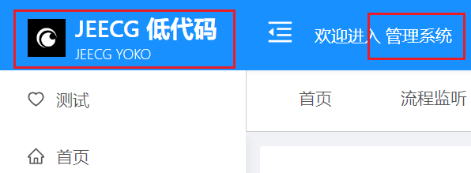
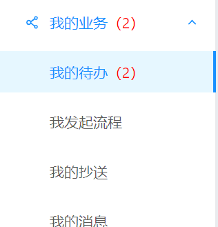
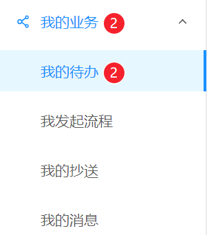

[返回](../)

# 个性化配置文档

系统名称、页脚等版权信息的自定义配置可通过env环境变量设置。
页面的Logo图片需要手动替换`src/assets/*`。

组件路径: 
* [.env(自定义配置文件)](https://github.com/yoko-murasame/ant-design-vue-jeecg/blob/yoko/.env)
* [org.jeecg.common.util.encryption.EncryptedString(登录密码加密的密钥配置类)](https://github.com/yoko-murasame/jeecg-boot/blob/yoko-3.4.3last//jeecg-boot-base-core/src/main/java/org/jeecg/common/util/encryption/EncryptedString.java)
* [request.js(Axios请求类)](https://github.com/yoko-murasame/ant-design-vue-jeecg/blob/yoko/src/utils/request.js)
  * 添加部署环境的PUT、DELETE请求转换成POST请求配置，部署后请参考[Nginx配置示例](https://github.com/yoko-murasame/jeecg-boot/blob/yoko-3.4.3last/docs/DevOps/nginx)。
* [MenuUtil.js(菜单嵌入我的代办数量提示)](https://github.com/yoko-murasame/ant-design-vue-jeecg/blob/yoko/src/components/yoko/utils/MenuUtil.js)

使用示例:
```properties
# 目前已添加的环境变量
# 个性化配置
VUE_APP_PLATFORM_NAME=JeecgBoot 企业级低代码平台
VUE_APP_PLATFORM_DESC=JeecgBoot 企业级低代码平台
VUE_APP_LOGO_NAME_CH=JEECG 低代码
VUE_APP_LOGO_NAME_EN=JEECG YOKO
VUE_APP_FOOTER_TEXT=技术支持：Yoko
# 启用菜单栏的我的待办数量显示
VUE_APP_ENABLE_NAVBAR_TODO_NUM=true
```

Logo效果



我的代办数量提示效果



样式优化效果




修改历史:
* 2023-08-21: 新增jeecg菜单动态展示我的流程代办数量
* 2023-07-12: 登录接口添加默认密码加密
* 2023-07-12: 新增。
