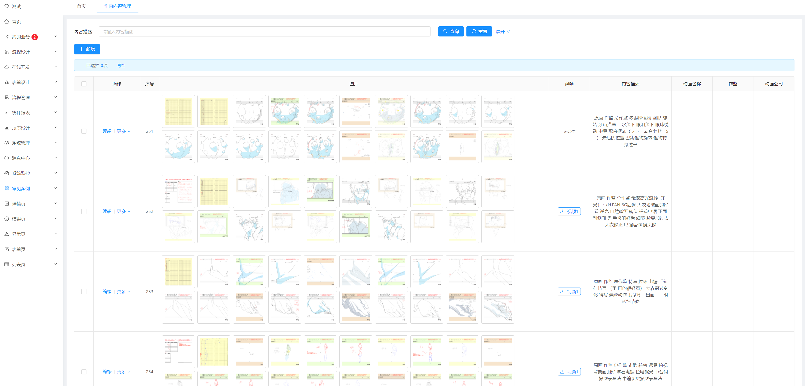
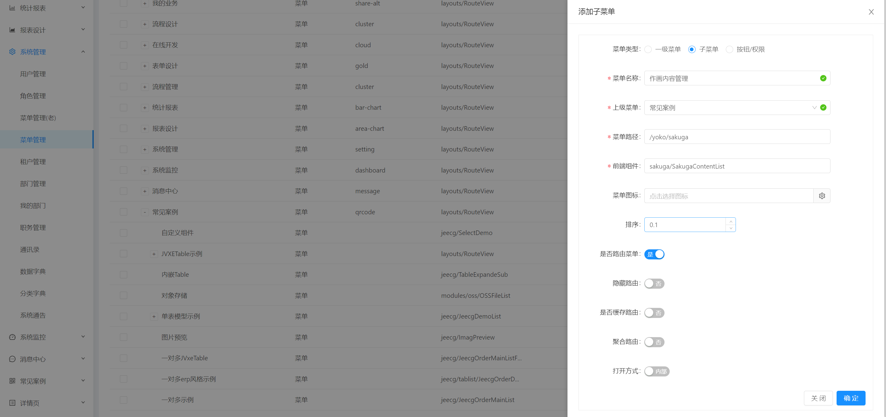

[返回](../)

# 暗黑作画禁书目录

基于Jeecg开发的一个动漫图片管理模块，应用了PostgreSQL默认的分词技术，支持中文分词查询。




* [SQL路径](https://github.com/yoko-murasame/jeecg-boot/blob/yoko-3.4.3last/db/PostgreSQL/可选/sakuga_content.sql)
* [后端路径](https://github.com/yoko-murasame/jeecg-boot/blob/yoko-3.4.3last/org/jeecg/modules/sakuga)
* [前端路径](https://github.com/yoko-murasame/ant-design-vue-jeecg/blob/yoko/src/views/sakuga)

路由配置: 

```json
{
  "path": "/yoko/sakuga",
  "module": "sakuga/SakugaContentList"
}
```



功能点:
* content内容字段做了分词查询，并用高亮显示
* aliyun视频播放功能

修改历史:
* 2023-08-23: 新增分词功能示例、分词功能开发步骤

## PostgreSQL分词功能开发步骤

首先确保数据库启用了分词扩展：

```sql
CREATE EXTENSION zhparser;
CREATE TEXT SEARCH CONFIGURATION chinese (PARSER = zhparser);
ALTER TEXT SEARCH CONFIGURATION chinese
    ADD MAPPING FOR a,b,c,d,e,f,g,h,i,j,k,l,m,n,o,p,q,r,s,t,u,v,w,x,y,z
        WITH simple;
```

扩展名称我们设置成：`chinese`，现在有一个长文本字段：`content`，想要对这个字段进行分词查询的sql写法如下：

```sql
SELECT a.*
FROM sakuga_content a
WHERE a.content @@ to_tsquery('chinese', '一段查询条件描述');
```

然而这种方式**每一次查询都会转换一次向量**，效率较低，因此我们需要创建分词向量字段：

```sql
-- 添加向量字段
ALTER TABLE sakuga_content ADD COLUMN content_tsv tsvector;
-- 手动更新向量字段（为多个字段向量化）
UPDATE sakuga_content
SET content_tsv = setweight(to_tsvector('chinese', title), 'A') ||
                  setweight(to_tsvector('chinese', content), 'B')
WHERE 1=1;
-- 为这个向量字段创建索引
CREATE INDEX sakuga_content_content_gin_index ON sakuga_content USING gin (content_tsv);
```

在 SQL 语句中，我们首先为`sakuga_content`数据表新增了一个`content_tsv`字段，字段类型为`tsvector`。有了该字段后，我们需要为该字段赋值，通过`to_tsvector`我们将每行数据的`title`和`content`分别向量化。

由于`title`和`content`的重要性不一样，标题明显比内容数据更加重要，因此`setweight`设置标题的权重为A，而内容的权重为B，A的重要性大于B。`||`操作符合并向量后将结果赋给`content_tsv`。

需要注意的是，如果`title`字段的值为空，那么**向量化会失效（NULL值）**，因此我这里只为`content`字段向量化：

```sql
-- 手动更新向量字段（为单个字段向量化）
UPDATE sakuga_content
SET content_tsv = setweight(to_tsvector('chinese', content), 'A')
WHERE 1=1;
```

到此，`sakuga_content`表中新增了一个`content_tsv`字段，字段中是`content`字段内容中分词后的词组列表。最后为`content_tsv`字段我们新建了索引 `sakuga_content_content_gin_index` 来加速我们的搜索效率。

现在可以通过向量字段查询，并走索引，查询sql：

```sql
SELECT a.*
FROM sakuga_content a
WHERE a.content_tsv @@ to_tsquery('chinese', '一段查询条件描述');
```

然后，记得在数据修改、编辑的过程中，更新向量字段的值，这里我使用了触发器来实现：

```sql
CREATE OR REPLACE FUNCTION update_content_tsv() RETURNS TRIGGER AS $$
BEGIN
    NEW.content_tsv := to_tsvector('chinese', COALESCE(NEW.content, ''));
    RETURN NEW;
END;
$$ LANGUAGE plpgsql;

CREATE TRIGGER trg_update_content_tsv
    BEFORE INSERT OR UPDATE ON sakuga_content
    FOR EACH ROW
EXECUTE FUNCTION update_content_tsv();
```

这个触发器中，当你向 `sakuga_content` 表插入或更新数据时，触发器将自动将 `content` 字段的内容向量化并存储到 `content_tsv` 字段中。请确保在插入或更新数据时，`content` 字段的值已经设置好。

向量化、分词查询讲得差不多了，接着让我们看一下**高亮结果**该怎么写：

```sql
SELECT a.*, ts_headline(a.content, to_tsquery('chinese', '一段查询条件描述')) AS content_highlight
FROM sakuga_content a
WHERE a.content_tsv @@ to_tsquery('chinese', '一段查询条件描述');
```

这个查询中，`to_tsquery`函数将`content`字段的值和用户查询的分词结果进行匹配，最终将匹配的分词结果以`<b></b>`标签包裹并返回给`content_highlight`字段。

至此，分词功能的接口开发内容基本都在这里了，具体代码实现就不再赘述，可以参考当前文档对应的模块的代码实现。


## 归档
```markdown
# App
docker run -di --name sakuga --restart=unless-stopped -p 9900:8888 -v /root/application/sakuga:/app app-split

# Nginx
docker run --name nginx \
-p 8888:8888 \
-v /root/nginx/conf/nginx.conf:/etc/nginx/nginx.conf \
-v /root/nginx/conf/conf.d:/etc/nginx/conf.d \
-v /root/nginx/html:/etc/nginx/html \
-v /root/nginx/log:/var/log/nginx \
-v /root/application/upFiles:/upFiles \
-di nginx

# Redis
docker run -di --restart=unless-stopped --name=redis -p 63791:63791 redis --requirepass "123456" --port "63791" --appendonly "yes"

# 防火墙相关 https://juejin.cn/post/6844903865146425351
```
