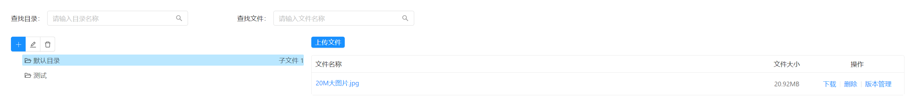

[返回](../)

# 知识库

一个不断完善的文档管理系统。



* [SQL路径](https://github.com/yoko-murasame/jeecg-boot/blob/yoko-3.4.3last/db/增量SQL/3.4.3文件模块扩展.sql)
* [后端路径](https://github.com/yoko-murasame/jeecg-boot/blob/yoko-3.4.3last/jeecg-module-system/jeecg-system-start/src/main/java/org/jeecg/modules/technical)
* [前端路径](https://github.com/yoko-murasame/ant-design-vue-jeecg/blob/yoko/src/views/modules/knowledge)

## 使用

路由配置：

```json
{
  "name": "知识库",
  "path": "/knowledge",
  "module": "modules/knowledge/Knowledge"
}
```

数据权限-全目录-全文件-查看权限：未配置时默认不生效，**该权限未授权时，用户访问根目录为空的情况下，将不会自动创建默认目录！**

```json
{
  "sortOrder": 1,
  "name": "数据权限-全目录-全文件-查看权限",
  "perms": "KNOWLEDGE_FOLDER_USER_FULL",
  "perms_type": "1(可见/可访问(授权后可见/可访问))"
}
```

按钮权限-目录-新增按钮：未配置时默认开放

```json
{
  "sortOrder": 2,
  "name": "按钮权限-目录-新增按钮",
  "perms": "KNOWLEDGE_FOLDER_ADD_BUTTON",
  "perms_type": "1(可见/可访问(授权后可见/可访问))"
}
```

按钮权限-目录-编辑按钮：未配置时默认开放

```json
{
  "sortOrder": 3,
  "name": "按钮权限-目录-编辑按钮",
  "perms": "KNOWLEDGE_FOLDER_EDIT_BUTTON",
  "perms_type": "1(可见/可访问(授权后可见/可访问))"
}
```

按钮权限-目录-删除按钮：未配置时默认开放

```json
{
  "sortOrder": 4,
  "name": "按钮权限-目录-删除按钮",
  "perms": "KNOWLEDGE_FOLDER_DELETE_BUTTON",
  "perms_type": "1(可见/可访问(授权后可见/可访问))"
}
```

按钮权限-目录-授权按钮：未配置时默认隐藏

```json
{
  "sortOrder": 5,
  "name": "按钮权限-目录-授权按钮",
  "perms": "KNOWLEDGE_FOLDER_USER_AUTH_BUTTON",
  "perms_type": "1(可见/可访问(授权后可见/可访问))"
}
```

按钮权限-文件-下载按钮：未配置时默认开放

```json
{
  "sortOrder": 6,
  "name": "按钮权限-文件-下载按钮",
  "perms": "KNOWLEDGE_FILE_DOWNLOAD_BUTTON",
  "perms_type": "2(可编辑(未授权时禁用))"
}
```

按钮权限-文件-打标签按钮：未配置时默认隐藏

```json
{
  "sortOrder": 7,
  "name": "按钮权限-文件-打标签按钮",
  "perms": "KNOWLEDGE_FILE_TAG_BUTTON",
  "perms_type": "2(可编辑(未授权时禁用))"
}
```

按钮权限-文件-重命名按钮：未配置时默认隐藏

```json
{
  "sortOrder": 8,
  "name": "按钮权限-文件-重命名按钮",
  "perms": "KNOWLEDGE_FILE_RENAME_BUTTON",
  "perms_type": "2(可编辑(未授权时禁用))"
}
```

按钮权限-文件-版本管理按钮：未配置时默认隐藏

```json
{
  "sortOrder": 9,
  "name": "按钮权限-文件-版本管理按钮",
  "perms": "KNOWLEDGE_FILE_VERSION_BUTTON",
  "perms_type": "2(可编辑(未授权时禁用))"
}
```

按钮权限-文件-删除按钮：未配置时默认开放

```json
{
  "sortOrder": 10,
  "name": "按钮权限-文件-删除按钮",
  "perms": "KNOWLEDGE_FILE_DELETE_BUTTON",
  "perms_type": "2(可编辑(未授权时禁用))"
}
```

功能点:
* 任意层级的嵌套目录、基于前端JSON格式自动初始化目录
* 基于后端的严格文件格式限制
* 支持文件版本管理、文件恢复
* 双主键业务模式绑定
* 图片、视频、PDF预览功能（一定程度上防止用户下载）
* 目录、文件列表所有操作按钮授权
* 实现授权按钮是否配置检测
* 接入 `vue-pdf-app` 插件，支持PDF预览、放大、下载权限控制等


## 修改历史

* 2023-09-11: 新增知识库模块。
* 2023-10-21: 知识库模块-根目录、子目录相关-增删改功能BUG测试、修复
* 2023-10-21: 知识库模块-实现文件标签功能、标签添加、多标签异步搜索、标签高亮、文件重命名等功能。
* 2023-10-23: 知识库-大面积重构代码、精简优化逻辑，添加删除目录后自动回选父目录、增删改查目录后自动递归更新目录信息、上传文件后自动递归更新目录信息、高亮存在子目录&子文件的目录节点等功能。
* 2023-10-23: 知识库-重构文件列表模块用以复用&问题处理、调整目录树列表样式、添加搜索结果多结果微微高亮效果
* 2023-11-02: 知识库-实现目录、文件按个人角色授权功能
* 2023-11-23: 知识库-实现下载按钮授权，常见图片、视频、PDF预览时不提供下载；仅当系统存在下载授权按钮时，此功能生效。

# 归档

## vue-pdf

安装：
```shell
# 这个版本的为fork分支，修复了部分bug
yarn add @teckel/vue-pdf
```

使用：
```vue
<template>
  <div>
    <j-modal
      :visible="pdfVisible"
      switchFullscreen
      cancelText="关闭"
      :maskClosable="false"
      title="PDF预览"
      ok-text=""
      cancel-text="关闭"
      @cancel="onPdfClose"
      @ok="onPdfClose"
      width="60vw">
      <template slot="footer">
        <cancel-button :disableSubmit="true" key="back" @click="onPdfClose" />
      </template>
      <!--<pdf v-if='pdfUrl' :src="pdfUrl"></pdf>-->
      <pdf
        v-for="i in pdfPages"
        :key="i"
        :src="pdfSrc"
        :page="i"
        style="display: inline-block; width: 100%"
      ></pdf>
    </j-modal>
  </div>
</template>
<script>
  import pdf from '@teckel/vue-pdf'
  export default {
    data() {
      return {
        // pdf预览
        pdfUrl: '',
        pdfTitle: '',
        pdfVisible: false,
        pdfPages: 0,
        pdfSrc: null
      }
    },
    methods: {
      onPdfClose() {
        this.pdfUrl = null
        this.pdfVisible = false
        this.pdfPages = 0
        this.pdfSrc = null
      },
      handlePreview(record) {
        console.log('handlePreview', record)
        const dotName = `.${record.suffix.toLowerCase()}`
        const fileUrl = this.downloadCompleteUrl + record.id
        if (/pdf/.test(dotName)) {
          this.pdfUrl = fileUrl
          this.pdfTitle = record.name
          const pdfSrc = pdf.createLoadingTask(this.pdfUrl)
          pdfSrc.promise.then(pdf => {
            this.pdfPages = pdf.numPages
            this.pdfSrc = pdfSrc
            this.pdfVisible = true
          })
        }
      }
    }
  }
</script>
```

## 按钮权限-显隐改禁用

默认基于`v-has`去控制按钮权限的显隐，如果需要换成禁用，这里以`FileList.vue`组件改造为例，参考下代码即可：
```vue
<template>
  <div>
    <a-table>
      <template slot="action" slot-scope="text, record">
        <!--仅当系统已配置此按钮权限时，才生效-->
        <template v-if="KNOWLEDGE_FILE_DOWNLOAD_BUTTON_FLAG">
          <a :disabled="isDisabledAuth(KNOWLEDGE_FILE_DOWNLOAD_BUTTON)" href="javascript:;" @click="handleDownload(record)">下载</a>
          <a-divider type="vertical"/>
          <a-dropdown>
            <a class="ant-dropdown-link">更多
              <a-icon type="down"/>
            </a>
            <a-menu slot="overlay">
              <a-menu-item :disabled="isDisabledAuth(KNOWLEDGE_FILE_DOWNLOAD_BUTTON)">
                <a-popconfirm :disabled="isDisabledAuth(KNOWLEDGE_FILE_DOWNLOAD_BUTTON)" title="确定删除吗?" @confirm="() => deleteFile(record.id)">
                  <a :disabled="isDisabledAuth(KNOWLEDGE_FILE_DOWNLOAD_BUTTON)">删除</a>
                </a-popconfirm>
              </a-menu-item>
            </a-menu>
          </a-dropdown>
        </template>
        <template v-else>
          <a href="javascript:;" @click="handleDownload(record)">下载</a>
          <a-divider type="vertical"/>
          <a-dropdown>
            <a class="ant-dropdown-link">更多
              <a-icon type="down"/>
            </a>
            <a-menu slot="overlay">
              <a-menu-item>
                <a-popconfirm title="确定删除吗?" @confirm="() => deleteFile(record.id)">
                  <a>删除</a>
                </a-popconfirm>
              </a-menu-item>
            </a-menu>
          </a-dropdown>
        </template>
      </template>
    </a-table>
  </div>
</template>
<script>
import { mapState } from 'vuex'
import { DisabledAuthFilterMixin } from '@/mixins/DisabledAuthFilterMixin'

export default {
  mixins: [DisabledAuthFilterMixin],
  computed: {
    ...mapState({
      KNOWLEDGE_FILE_DOWNLOAD_BUTTON: state => state.permission.KNOWLEDGE_FILE_DOWNLOAD_BUTTON,
      KNOWLEDGE_FILE_DOWNLOAD_BUTTON_FLAG: state => state.permission.KNOWLEDGE_FILE_DOWNLOAD_BUTTON_FLAG
    })
  }
}
</script>
```

## 权限列表接口

```sql
-- 开发权限列表接口
WITH perm AS (SELECT *
              FROM technical_folder_user_permission
              WHERE username = 'yoko'),
     folder AS (SELECT id,
                       create_by,
                       create_time,
                       update_by,
                       update_time,
                       name,
                       level,
                       folder_order,
                       parent_id,
                       project_id,
                       project_name,
                       child_folder_size,
                       type,
                       child_file_size,
                       enabled,
                       business_id,
                       business_name,
                       tags
                FROM technical_folder)
SELECT folder.*, perm.username, perm.data_permission_type
FROM folder INNER JOIN perm ON folder.id = perm.folder_id
```
