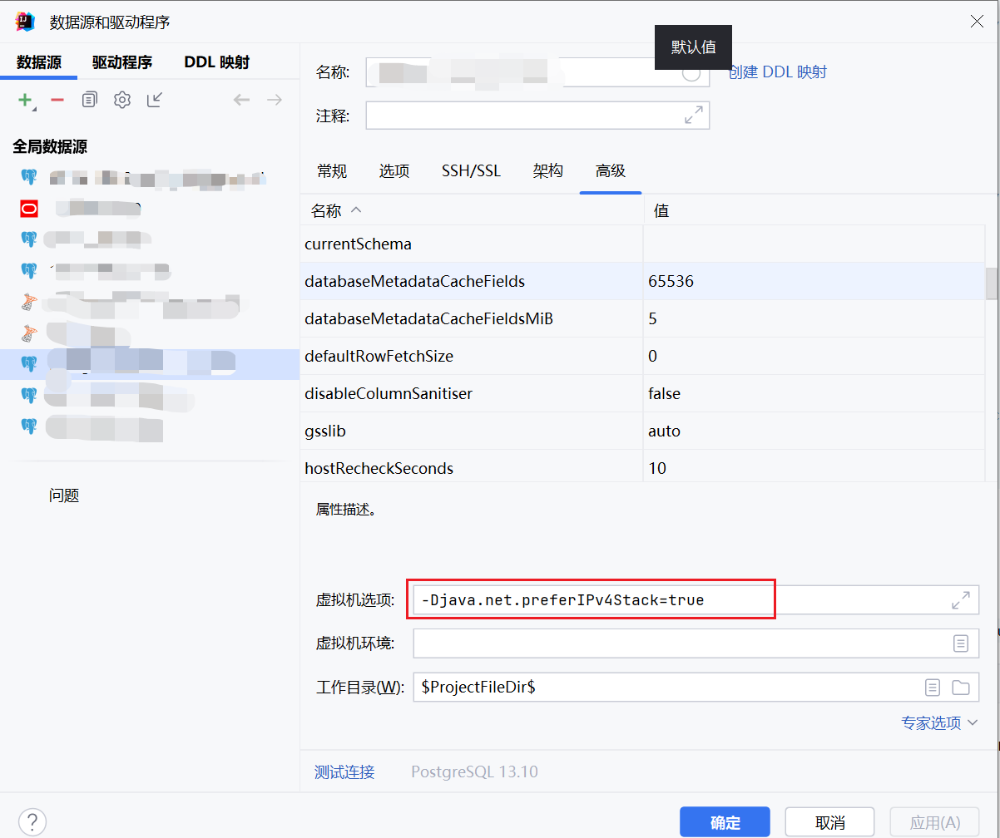

[返回](../)

# Oracle数据库安装参考文档

这里提供Oracle12c的Docker安装方式，其他版本的安装方式请自行参考。

* [11g备份路径(Jeecg官方)](https://github.com/yoko-murasame/jeecg-boot/blob/yoko-3.4.3last/db/Oracle)

修改历史:
* 2023-08-08: 新增
* 2023-08-09: 新增Oracle运维相关命令

## Oracle 12c的Docker版本安装步骤

1）镜像地址：

11g：https://hub.docker.com/r/wnameless/oracle-xe-11g-r2

12c：https://github.com/MaksymBilenko/docker-oracle-12c

2）下载镜像：

11g：`docker pull wnameless/oracle-xe-11g-r2`

12c：`docker pull quay.io/maksymbilenko/oracle-12c`

3）启动容器：
```shell
# 目录需要权限
mkdir -p /my/oracle/data
chmod 777 /my/oracle/data
#chown 54321:54322 /my/oracle/data

# 方式一 Run with data on host and reuse it:
docker run -d -p 8180:8080 -p 1521:1521 -v /my/oracle/data:/u01/app/oracle oracle-12c

# 方式二 Run with Custom DBCA_TOTAL_MEMORY (in Mb):
docker run -d -p 8180:8080 -p 1521:1521 -v /my/oracle/data:/u01/app/oracle -e DBCA_TOTAL_MEMORY=4096 quay.io/maksymbilenko/oracle-12c
```

4）连接数据库：
```text
hostname: localhost
port: 1521
sid: xe
service name: xe
username: system
password: oracle
```

```shell
sqlplus system/oracle@//localhost:1521/xe
#Password for SYS & SYSTEM: oracle
#sqlplus sys as sysdba/oracle@//localhost:1521/xe
# sqlplus sys as sysdba
```

5）创建用户、表空间：
```sql
-- 创建用户和表空间 特殊符号需要用双引号
CREATE USER jeecgboot IDENTIFIED BY "1234@123aqq";
-- 权限
-- GRANT CONNECT, RESOURCE, DBA TO jeecgboot;
GRANT DBA TO jeecgboot;
-- 创建自动扩容表空间（用户名和表空间名称最好一致）
CREATE TABLESPACE jeecgboot
    DATAFILE '/u01/app/oracle/oradata/xe/jeecgboot.dbf' SIZE 500M
    AUTOEXTEND ON NEXT 100M MAXSIZE 8G;
ALTER USER jeecgboot QUOTA UNLIMITED ON jeecgboot;

-- 查看表空间位置
SELECT file_name, tablespace_name, bytes, autoextensible
FROM dba_data_files;
-- 删除表空间
DROP TABLESPACE jeecgboot INCLUDING CONTENTS AND DATAFILES;
```

## 扩展

### 导入导出数据库

**密码带特殊符号时的规则**

windows os: `exp username/"""password"""@devdb` --3个双引号扩密码

linux/unix os: `exp 'username/"password"@devdb'` --1个双引号扩密码，1个单引号扩全部

```shell
-- 设置环境变量指定导入导出编码
export NLS_LANG=AMERICAN_AMERICA.UTF8


-- 完整导出命令，用户名即对应数据库，特殊密码需要用双引号扩起来，服务名一般为orcl、xe
-- exp 'username/"password@password"@127.0.0.1:15211/服务名' full=y file=export.dmp log=export.log
# 容器内的备份命令
docker exec -it <容器名> exp 'username/"password@password"@127.0.0.1:1521/服务名' full=y file=export.dmp log=export.log \ &&
docker cp <容器名>:/export.dmp ./ && docker exec -it <容器名> rm /export.dmp


-- 完整导入命令，用户名即对应数据库，特殊密码需要用双引号扩起来，服务名一般为orcl、xe
-- imp 'username/"password@password"@127.0.0.1:15211/服务名' full=y file=export.dmp log=import.log
# 容器内的导入命令
docker cp ./export.dmp <容器名>:/export.dmp && rm ./export.dmp \ &&
docker exec -it <容器名> imp 'username/"password@password"@127.0.0.1:1521/服务名' full=y file=export.dmp log=export.log && rm /export.dmp


-- 特殊情况 sys as sysdba 下的导出命令
# 一般不会拿sys as sysdba去导出，如果真有需求，参考下面命令
docker exec -it oracle-12c exp \'sys/\"带@的密码\"@127.0.0.1:1521/xe AS SYSDBA\' full=y file=export.dmp log=export.log

# 拿sys as sysdba导出时，可以指定scheme，注意 owner=(system,sys) 和 full=y 是冲突的
docker exec -it oracle-12c exp \'sys/\"带@的密码\"@127.0.0.1:1521/xe AS SYSDBA\' owner=system file=export.dmp log=export.log


-- 特殊情况 sys as sysdba 下的导入命令
# 拿sys as sysdba去导入时，可以指定scheme，需要指定 fromuser=(system,sys) 和 touser=(system,sys)
docker exec -it oracle-12c imp \'sys/\"带@的密码\"@127.0.0.1:1521/xe AS SYSDBA\' full=y file=export.dmp log=import.log

docker exec -it oracle-12c imp \'sys/\"带@的密码\"@127.0.0.1:1521/xe AS SYSDBA\' file=export.dmp log=import.log fromuser=system touser=system

# 在Windows上终端使用powershell时，需要先进容器，再执行导入命令
docker cp ./export.dmp oracle-12c:/export.dmp
docker exec -it oracle-12c bash
imp \'sys/\"带@的密码\"@127.0.0.1:1521/xe AS SYSDBA\' file=export.dmp log=import.log fromuser=zy touser=zy && rm /export.dmp
```

### 修改默认管理员账户密码

1. 首先，以具有 `SYSDBA` 角色的用户身份连接到 Oracle 数据库。可以使用以下命令连接到数据库：
   ```
   sqlplus / as sysdba
   ```
   这将启动 SQL*Plus 工具并使用操作系统认证连接到数据库。
2. 连接成功后，使用以下命令修改 `SYS` 用户的密码：
   ```
   ALTER USER sys IDENTIFIED BY "新密码翻入双引号可以写特殊符号如@";
   ALTER USER system IDENTIFIED BY "新密码翻入双引号可以写特殊符号如@";
   ```
   将 `new_password` 替换为你想要设置的新密码。
   注意：在修改 `SYS` 用户的密码时，请确保选择一个强密码，并妥善保管密码。
3. 修改密码后，你可以使用以下命令验证新密码是否起效：
   ```
   CONNECT sys/"带特殊符号的密码用双引号" AS SYSDBA;
   CONNECT system/"带特殊符号的密码用双引号";
   ```
   这将使用新密码连接到 `SYS` 用户。
4. 最后，退出 SQL*Plus 工具，可以使用以下命令：
   ```
   EXIT;
   ```

## Oracle高级SQL

### 递归结合分页高级查询

sql功能描述：

查询两个资产表 -> 将结果聚合 -> 翻译部门、用户名等字段 -> 联合中间状态表
-> 根据动态条件过滤（结合mybatisPlus）
-> 递归查询所有父项 -> 递归查询所有父项的子项（这个需求是，不同部门存在交叉数据时，需要查询出所有的父项和子项）
-> 最后去重并排序

```sql
WITH unit AS (select ORG_CODE, DEPART_NAME
              from SYS_DEPART),
     sysuser AS (SELECT USERNAME, REALNAME
                 FROM SYS_USER),
     house AS (select ID,
                      CREATE_TIME,
                      UPDATE_TIME,
                      ASSET_NUMBER,
                      ASSET_NAME,
                      ASSET_AREA,
                      PID,
                      '房产' AS ASSET_TYPE,
                      MANAGE_UNIT,
                      CREATE_UNIT,
                      HANDLER
               from ZY_HOUSE_ASSET
               where is_del = 0),
     land AS (select ID,
                     CREATE_TIME,
                     UPDATE_TIME,
                     ASSET_NUMBER,
                     ASSET_NAME,
                     ASSET_AREA,
                     PID,
                     '土地' AS ASSET_TYPE,
                     MANAGE_UNIT,
                     CREATE_UNIT,
                     HANDLER
              from ZY_LAND_ASSET
              where is_del = 0),
     house_view AS (select a.*,
                           b.DEPART_NAME AS MANAGE_UNIT_TEXT,
                           c.DEPART_NAME AS CREATE_UNIT_TEXT,
                           d.REALNAME    AS HANDLER_TEXT
                    from house a
                             left join unit b on a.MANAGE_UNIT = b.ORG_CODE
                             left join unit c on a.CREATE_UNIT = c.ORG_CODE
                             left join sysuser d on a.HANDLER = d.USERNAME),
     land_view AS (select a.*,
                          b.DEPART_NAME AS MANAGE_UNIT_NAME,
                          c.DEPART_NAME AS CREATE_UNIT_NAME,
                          d.REALNAME    AS HANDLER_TEXT
                   from land a
                            left join unit b on a.MANAGE_UNIT = b.ORG_CODE
                            left join unit c on a.CREATE_UNIT = c.ORG_CODE
                            left join sysuser d on a.HANDLER = d.USERNAME),
     unit_view AS (select *
                   from house_view
                   union all
                   select *
                   from land_view),
     -- 接入同步中间状态(指定del_flag=0的为1=1关联，如果产生错误数据，就让交叉乘积的错误数据暴露出来)
     unit_sync_view AS (SELECT a.*, b.SYNC_STATE
                        FROM unit_view a
                                 LEFT JOIN ZY_ASSERT_SYNC_MIDDLE b
                                           ON a.ID = b.ASSERT_ID AND a.ASSET_TYPE = b.ASSERT_ID AND b.DEL_FLAG = 0),
     filter_view AS (select *
                     from unit_sync_view
                     where ASSET_NAME = '清东路站公共移动设备室'
                       AND MANAGE_UNIT = 'F'),
--                      where ASSET_NUMBER = 'ZY103-02000017-00003'),
--                      where ID = 'fcgz14000002212'),
     -- 递归查询所有父项
     parent_view AS (SELECT *
                     FROM unit_sync_view
                     START WITH ID IN (SELECT ID FROM filter_view)
                     CONNECT BY PRIOR PID = ID),
     -- 递归查询所有子项
--      children_view AS (SELECT *
--                      FROM unit_view
--                      START WITH ID IN (SELECT ID FROM filter_view)
--                      CONNECT BY PRIOR ID = PID),
     -- 递归查询所有父项的子项
     children_view AS (SELECT *
                       FROM unit_sync_view
                       START WITH ID IN (SELECT ID FROM parent_view)
                       CONNECT BY PRIOR ID = PID),
     unique_view AS (SELECT *
                     FROM parent_view
                     UNION
                     SELECT *
                     FROM children_view)
SELECT *
FROM unique_view
ORDER BY SYNC_STATE DESC, UPDATE_TIME DESC NULLS LAST, CREATE_TIME DESC
;

```

如果需要使用分页，必须针对root节点进行分页处理，下面是写成动态接口的示例：

mapper

```xml
<?xml version="1.0" encoding="UTF-8"?>
<!DOCTYPE mapper PUBLIC "-//mybatis.org//DTD Mapper 3.0//EN" "http://mybatis.org/dtd/mybatis-3-mapper.dtd">
<mapper namespace="org.jeecg.modules.zy.sync.mapper.ZyAssertSyncMiddleMapper">
    <!--分页仅作用于递归筛选查询出的所有root节点数据，也在这里排序-->
    <sql id="listSql">
        WITH unit AS (select ORG_CODE, DEPART_NAME
                      from SYS_DEPART),
             sysuser AS (SELECT USERNAME, REALNAME
                         FROM SYS_USER),
             sync_dict AS (SELECT item_text, item_value
                           FROM sys_dict_item
                           WHERE dict_id = (SELECT id FROM sys_dict WHERE dict_code = 'zy_asset_sync_state')),
             house AS (select ID,
                              CREATE_TIME,
                              UPDATE_TIME,
                              ASSET_NUMBER,
                              ASSET_NAME,
                              ASSET_AREA,
                              PID,
                              HAS_CHILD,
                              '房产' AS ASSET_TYPE,
                              MANAGE_UNIT,
                              CREATE_UNIT,
                              HANDLER
                       from ZY_HOUSE_ASSET
                       where is_del = 0),
             land AS (select ID,
                             CREATE_TIME,
                             UPDATE_TIME,
                             ASSET_NUMBER,
                             ASSET_NAME,
                             ASSET_AREA,
                             PID,
                             HAS_CHILD,
                             '土地' AS ASSET_TYPE,
                             MANAGE_UNIT,
                             CREATE_UNIT,
                             HANDLER
                      from ZY_LAND_ASSET
                      where is_del = 0),
             house_view AS (select a.*,
                                   b.DEPART_NAME               AS MANAGE_UNIT_TEXT,
                                   c.DEPART_NAME               AS CREATE_UNIT_TEXT,
                                   d.REALNAME                  AS HANDLER_TEXT,
                                   COALESCE(e.SYNC_STATE, '1') AS SYNC_STATE,
                                   e.LATEST_SYNC_TIME
                            from house a
                                     left join unit b on a.MANAGE_UNIT = b.ORG_CODE
                                     left join unit c on a.CREATE_UNIT = c.ORG_CODE
                                     left join sysuser d on a.HANDLER = d.USERNAME
                                     left join ZY_ASSERT_SYNC_MIDDLE e
                                               on a.ID = e.ASSERT_ID AND a.ASSET_TYPE = e.ASSERT_ID AND e.DEL_FLAG = 0),
             land_view AS (select a.*,
                                  b.DEPART_NAME               AS MANAGE_UNIT_NAME,
                                  c.DEPART_NAME               AS CREATE_UNIT_NAME,
                                  d.REALNAME                  AS HANDLER_TEXT,
                                  COALESCE(e.SYNC_STATE, '1') AS SYNC_STATE,
                                  e.LATEST_SYNC_TIME
                           from land a
                                    left join unit b on a.MANAGE_UNIT = b.ORG_CODE
                                    left join unit c on a.CREATE_UNIT = c.ORG_CODE
                                    left join sysuser d on a.HANDLER = d.USERNAME
                                    left join ZY_ASSERT_SYNC_MIDDLE e
                                              on a.ID = e.ASSERT_ID AND a.ASSET_TYPE = e.ASSERT_ID AND e.DEL_FLAG = 0),
             unit_view AS (select *
                           from house_view
                           union all
                           select *
                           from land_view),
             unit_sync_view AS (SELECT a.*, b.ITEM_TEXT AS SYNC_STATE_TEXT
                                FROM unit_view a
                                         LEFT JOIN sync_dict b ON a.SYNC_STATE = b.item_value),
             filter_view AS (select *
                             from unit_sync_view ${ew.customSqlSegment}),
             parent_view AS (SELECT *
                             FROM unit_sync_view
                             START WITH ID IN (SELECT ID FROM filter_view)
                             CONNECT BY PRIOR PID = ID),
             parent_distinct_view AS (SELECT DISTINCT *
                                      FROM parent_view
                                      WHERE PID = '0'
                                      ORDER BY SYNC_STATE DESC, UPDATE_TIME DESC NULLS LAST, CREATE_TIME DESC),
        parent_page_view AS (
        <if test="queryType eq 'pageParent'">
            SELECT ID,
                   CREATE_TIME,
                   UPDATE_TIME,
                   ASSET_NUMBER,
                   ASSET_NAME,
                   ASSET_AREA,
                   PID,
                   HAS_CHILD,
                   ASSET_TYPE,
                   MANAGE_UNIT,
                   CREATE_UNIT,
                   HANDLER,
                   MANAGE_UNIT_TEXT,
                   CREATE_UNIT_TEXT,
                   HANDLER_TEXT,
                   SYNC_STATE,
                   LATEST_SYNC_TIME,
                   SYNC_STATE_TEXT
            FROM (SELECT TMP.*,
                         ROWNUM ROW_ID
                  FROM parent_distinct_view TMP
                  WHERE ROWNUM <![CDATA[<=]]> ${page} * ${size})
            WHERE ROW_ID <![CDATA[>]]> (${page} - 1) * ${size}
        </if>
        <if test="queryType neq 'pageParent'">
            select *
            from parent_distinct_view
        </if>
        ),
            children_view AS (SELECT *
                              FROM unit_sync_view
                              START WITH ID IN (SELECT ID FROM parent_page_view)
                              CONNECT BY PRIOR ID = PID),
            unique_view AS (SELECT *
                            FROM parent_page_view
                            UNION
                            SELECT *
                            FROM children_view)
        <if test="queryType neq 'countParent'">
            SELECT *
            FROM unique_view
            ORDER BY SYNC_STATE DESC, UPDATE_TIME DESC NULLS LAST, ASSET_NAME DESC
        </if>
        <if test="queryType eq 'countParent'">
            SELECT COUNT(DISTINCT ID)
            FROM parent_distinct_view
        </if>
    </sql>

    <!--由于采用了头尾递归，最后的返回结果一定是以root的数量为准，因此分页插件失效，需要手动重写-->
    <select id="pageVo" resultType="org.jeecg.modules.zy.sync.entity.vo.ZyAssertSyncMiddleVo">
        <bind name="queryType" value="'pageError'"/>
        <include refid="listSql"/>
    </select>

    <select id="listVo" resultType="org.jeecg.modules.zy.sync.entity.vo.ZyAssertSyncMiddleVo">
        <bind name="queryType" value="'list'"/>
        <include refid="listSql"/>
    </select>

    <!--统计父节点的数量-->
    <select id="countVoOnlyParent" resultType="long">
        <bind name="queryType" value="'countParent'"/>
        <include refid="listSql"/>
    </select>

    <select id="pageVoOnlyParent" resultType="org.jeecg.modules.zy.sync.entity.vo.ZyAssertSyncMiddleVo">
        <bind name="queryType" value="'pageParent'"/>
        <include refid="listSql"/>
    </select>

</mapper>

```

service

```java
import cn.hutool.core.collection.IterUtil;
import com.baomidou.mybatisplus.core.conditions.Wrapper;
import com.baomidou.mybatisplus.core.metadata.IPage;
import com.baomidou.mybatisplus.core.toolkit.Wrappers;
import com.baomidou.mybatisplus.extension.plugins.pagination.Page;
import org.jeecg.modules.zy.sync.entity.ZyAssertSyncMiddle;
import org.jeecg.modules.zy.sync.entity.vo.ZyAssertSyncMiddleVo;
import org.jeecg.modules.zy.sync.mapper.ZyAssertSyncMiddleMapper;
import org.jeecg.modules.zy.sync.service.IZyAssertSyncMiddleService;
import org.springframework.stereotype.Service;

import com.baomidou.mybatisplus.extension.service.impl.ServiceImpl;

import javax.annotation.Resource;
import java.io.Serializable;
import java.util.ArrayList;
import java.util.List;
import java.util.Map;
import java.util.Optional;

@Service
public class ZyAssertSyncMiddleServiceImpl extends ServiceImpl<ZyAssertSyncMiddleMapper, ZyAssertSyncMiddle> implements IZyAssertSyncMiddleService {

    @Resource
    private ZyAssertSyncMiddleMapper zyAssertSyncMiddleMapper;

    @Override
    public IPage<ZyAssertSyncMiddleVo> pageVo(Page<ZyAssertSyncMiddleVo> page, Wrapper<ZyAssertSyncMiddleVo> queryWrapper) {
        Page<ZyAssertSyncMiddleVo> pageResult = new Page<>(page.getCurrent(), page.getSize());
        long countVoOnlyParent = zyAssertSyncMiddleMapper.countVoOnlyParent(queryWrapper);
        pageResult.setTotal(countVoOnlyParent);
        if (countVoOnlyParent > 0) {
            List<ZyAssertSyncMiddleVo> result = zyAssertSyncMiddleMapper.pageVoOnlyParent(queryWrapper, page.getCurrent(), page.getSize());
            pageResult.setRecords(this.toTree(result));
        }
        return pageResult;
    }

    @Override
    public List<ZyAssertSyncMiddleVo> listVo(Wrapper<ZyAssertSyncMiddleVo> queryWrapper) {
        List<ZyAssertSyncMiddleVo> result = zyAssertSyncMiddleMapper.listVo(queryWrapper);
        return this.toTree(result);
    }

    private List<ZyAssertSyncMiddleVo> toTree(List<ZyAssertSyncMiddleVo> result) {
        Map<String, ZyAssertSyncMiddleVo> listMap = IterUtil.toMap(result, ZyAssertSyncMiddleVo::getId);
        List<ZyAssertSyncMiddleVo> roots = new ArrayList<>();
        result.forEach(item -> {
            if (ROOT_PID_VALUE.equals(item.getPid())) {
                roots.add(item);
                return;
            }
            Optional.ofNullable(listMap.get(item.getPid())).ifPresent(parent -> parent.getChildren().add(item));
        });
        return roots;
    }

    @Override
    public ZyAssertSyncMiddleVo getOneVo(Wrapper<ZyAssertSyncMiddleVo> queryWrapper) {
        return zyAssertSyncMiddleMapper.listVo(queryWrapper).get(0);
    }

    @Override
    public ZyAssertSyncMiddleVo getByIdVo(Serializable id) {
        return zyAssertSyncMiddleMapper.listVo(Wrappers.lambdaQuery(ZyAssertSyncMiddleVo.class).eq(ZyAssertSyncMiddleVo::getId, id)).get(0);
    }

}

```

分页SQL的渲染结果:

```sql
WITH unit AS (select ORG_CODE,
                     DEPART_NAME
              from SYS_DEPART),
     sysuser AS (SELECT USERNAME,
                        REALNAME
                 FROM SYS_USER),
     house AS (select ID,
                      CREATE_TIME,
                      UPDATE_TIME,
                      ASSET_NUMBER,
                      ASSET_NAME,
                      ASSET_AREA,
                      PID,
                      '房产' AS ASSET_TYPE,
                      MANAGE_UNIT,
                      CREATE_UNIT,
                      HANDLER
               from ZY_HOUSE_ASSET
               where is_del = 0),
     land AS (select ID,
                     CREATE_TIME,
                     UPDATE_TIME,
                     ASSET_NUMBER,
                     ASSET_NAME,
                     ASSET_AREA,
                     PID,
                     '土地' AS ASSET_TYPE,
                     MANAGE_UNIT,
                     CREATE_UNIT,
                     HANDLER
              from ZY_LAND_ASSET
              where is_del = 0),
     house_view AS (select a.*,
                           b.DEPART_NAME AS MANAGE_UNIT_TEXT,
                           c.DEPART_NAME AS CREATE_UNIT_TEXT,
                           d.REALNAME    AS HANDLER_TEXT
                    from house a
                             left join
                         unit b
                         on a.MANAGE_UNIT = b.ORG_CODE
                             left join
                         unit c
                         on a.CREATE_UNIT = c.ORG_CODE
                             left join
                         sysuser d
                         on a.HANDLER = d.USERNAME),
     land_view AS (select a.*,
                          b.DEPART_NAME AS MANAGE_UNIT_NAME,
                          c.DEPART_NAME AS CREATE_UNIT_NAME,
                          d.REALNAME    AS HANDLER_TEXT
                   from land a
                            left join
                        unit b
                        on a.MANAGE_UNIT = b.ORG_CODE
                            left join
                        unit c
                        on a.CREATE_UNIT = c.ORG_CODE
                            left join
                        sysuser d
                        on a.HANDLER = d.USERNAME),
     unit_view AS (select *
                   from house_view
                   union
                       all
                   select *
                   from land_view),
     unit_sync_view AS (SELECT a.*,
                               b.SYNC_STATE
                        FROM unit_view a
                                 LEFT JOIN
                             ZY_ASSERT_SYNC_MIDDLE b
                             ON a.ID = b.ASSERT_ID
                                 AND a.ASSET_TYPE = b.ASSERT_ID
                                 AND b.DEL_FLAG = 0),
     filter_view AS (select *
                     from unit_sync_view
                     WHERE (asset_type = '房产'
                         AND manage_unit_text = 'xxx')),
     parent_view AS (SELECT *
                     FROM unit_sync_view
                     START WITH ID IN (SELECT ID
                                       FROM filter_view)
                     CONNECT BY PRIOR PID = ID),
     parent_distinct_view AS (SELECT DISTINCT *
                              FROM parent_view
                              WHERE PID = '0'
                              ORDER BY SYNC_STATE DESC,
                                       UPDATE_TIME DESC NULLS LAST,
                                       CREATE_TIME DESC),
     parent_page_view AS (SELECT
                              -- 不能带入 ROWNUM ROW_ID 字段要不union字段匹配不上，底下也加rowNum会报错因此所有字段列出来
                              ID,
                              CREATE_TIME,
                              UPDATE_TIME,
                              ASSET_NUMBER,
                              ASSET_NAME,
                              ASSET_AREA,
                              PID,
                              ASSET_TYPE,
                              MANAGE_UNIT,
                              CREATE_UNIT,
                              HANDLER,
                              MANAGE_UNIT_TEXT,
                              CREATE_UNIT_TEXT,
                              HANDLER_TEXT,
                              SYNC_STATE
                          FROM (SELECT TMP.*,
                                       ROWNUM ROW_ID
                                FROM parent_distinct_view TMP
                                WHERE ROWNUM <= 1 * 10)
                          WHERE ROW_ID > (1 - 1) * 10),
     children_view AS (SELECT *
                       FROM unit_sync_view
                       START WITH ID IN (SELECT ID
                                         FROM parent_page_view)
                       CONNECT BY PRIOR ID = PID),
     unique_view AS ((SELECT *
                      FROM parent_page_view)
                     UNION
                     (SELECT *
                      FROM children_view))
SELECT *
FROM unique_view;

```

## 归档

### 11g备份导入到12c

要将 Oracle 11g 中编码为 `AMERICAN_AMERICA.ZHS16GBK` 的备份文件导入到 Oracle 12c 中编码为 `AL32UTF8` 的数据库，可以按照以下步骤进行操作：

1. 在 Oracle 12c 数据库中创建一个新的目标用户（schema），用于导入数据。

2. 确保 Oracle 12c 数据库的字符集编码已设置为 `AL32UTF8`。可以通过查询 `NLS_DATABASE_PARAMETERS` 视图来验证。

3. 在 Oracle 12c 数据库中创建一个目录对象，用于存储导入文件。可以使用 `CREATE DIRECTORY` 语句创建目录对象，指定一个合适的目录路径。

4. 将备份文件（`.dmp`）复制到 Oracle 12c 服务器上，并确保该文件可以被 Oracle 12c 用户访问。

5. 在 Oracle 12c 数据库中使用 `IMPDP` 工具执行导入操作。以下是一个示例命令：

```sql
impdp username/password@service_name directory=directory_name dumpfile=backup_file.dmp logfile=import.log remap_schema=source_user:target_user
```

其中：
- `username/password` 是 Oracle 12c 数据库的用户名和密码。
- `service_name` 是 Oracle 12c 数据库的服务名。
- `directory_name` 是步骤 3 中创建的目录对象的名称。
- `backup_file.dmp` 是备份文件的名称。
- `import.log` 是导入过程的日志文件名称。
- `source_user` 是备份文件中的源用户（schema）名称。
- `target_user` 是步骤 1 中创建的目标用户（schema）名称。

请根据实际情况替换上述命令中的参数，并确保正确设置了用户名、密码、服务名、目录对象和文件名等信息。

执行导入命令后，Oracle 12c 数据库将开始导入操作，并将数据转换为目标编码 `AL32UTF8`。

请注意，导入过程可能需要一些时间，具体取决于备份文件的大小和服务器性能。在导入过程中，可以查看导入日志文件以获取进度和错误信息。

在执行任何数据库操作之前，请务必备份数据库以防止数据丢失。

### 查询数据库编码

```sql
-- 查看数据库编码
SELECT value
FROM nls_database_parameters
WHERE parameter = 'NLS_CHARACTERSET';

-- 查看会话编码
SELECT value
FROM nls_session_parameters
WHERE parameter = 'NLS_CHARACTERSET';

```

### 迁移dbf文件目录（磁盘满的时候）

**[只支持同一个数据库示例下的dbf文件的不同目录之间的迁移，不支持跨数据库示例迁移](https://blog.51cto.com/u_15349616/3703787)**

检查目标数据库中是否已经存在同名的数据文件。可以使用以下查询语句检查：
```sql
SELECT file_name FROM dba_data_files WHERE file_name = '/u01/app/oracle/oradata/xe/ZY3.dbf';
```
如果查询结果返回了数据文件路径，表示该文件已经存在于目标数据库中。你可以选择使用现有的文件，或者选择不同的文件名进行迁移。
如果你希望使用现有的文件，你可以跳过添加数据文件的步骤。在目标数据库中，直接使用现有的数据文件进行恢复和打开表空间的操作。
如果你想使用不同的文件名进行迁移，你可以选择修改目标数据库中的数据文件名称。首先，使用以下语句将表空间设置为OFFLINE状态：
```sql
ALTER TABLESPACE ZY OFFLINE;
```
然后，使用以下语句修改数据文件的名称：
```sql
ALTER DATABASE RENAME FILE '/u01/app/oracle/oradata/xe/ZY3.dbf' TO '/u01/app/oracle/oradata/xe/NewFileName.dbf';
```
最后，使用以下语句将表空间设置为ONLINE状态：
```sql
ALTER TABLESPACE ZY ONLINE;
```
这样，你就可以在目标数据库中使用新的文件名进行迁移。
请注意，在进行任何数据库迁移操作之前，务必备份目标数据库以防止数据丢失或损坏。

**要迁移Oracle数据库的DBF文件，你可以按照以下步骤进行处理：**
1. 在目标数据库中创建相应的表空间：在目标数据库中使用`CREATE TABLESPACE`语句创建与源数据库相同的表空间。确保表空间的名称和数据文件的路径与源数据库相匹配。
2. 将源数据库的DBF文件复制到目标数据库：将源数据库的DBF文件复制到目标数据库的相应路径下。确保文件的权限和所有权与目标数据库所在的操作系统相匹配。
3. 在目标数据库中将DBF文件添加到表空间：使用`ALTER TABLESPACE`语句将复制的DBF文件添加到目标数据库的相应表空间中。例如：
   ```sql
   ALTER TABLESPACE your_tablespace_name ADD DATAFILE '/path/to/your/dbf/file.dbf' SIZE 100M;
   ```
   这将在目标数据库中将DBF文件添加到指定的表空间中，并指定文件的大小。
4. 在目标数据库中进行数据文件的恢复：如果DBF文件是从一个活动的源数据库复制过来的，你可能不需要进行数据文件的恢复。但如果DBF文件是从一个非活动的源数据库复制过来的，你需要使用Oracle的`RECOVER`命令对目标数据库中的数据文件进行恢复。例如：
   ```sql
   RECOVER DATAFILE '/path/to/your/dbf/file.dbf';
   ```
   这将对指定的数据文件进行恢复操作。
5. 在目标数据库中打开表空间：使用`ALTER TABLESPACE`语句将表空间设置为可用状态。例如：
   ```sql
   ALTER TABLESPACE your_tablespace_name ONLINE;
   ```
   这将打开指定的表空间，使其可供数据库使用。
完成以上步骤后，你的DBF文件应该已成功迁移到目标数据库，并可以在目标数据库中使用。请注意，在进行任何数据库迁移操作之前，务必备份源数据库以防止数据丢失或损坏。


### 特殊问题记录

1）[使用EasyConnect后，用navicat可以访问数据库，但是用Idea跑项目连接超时怎么办](https://blog.csdn.net/qq_32447361/article/details/121862199)

解决：添加jvm参数`-Djava.net.preferIPv4Stack=true`

