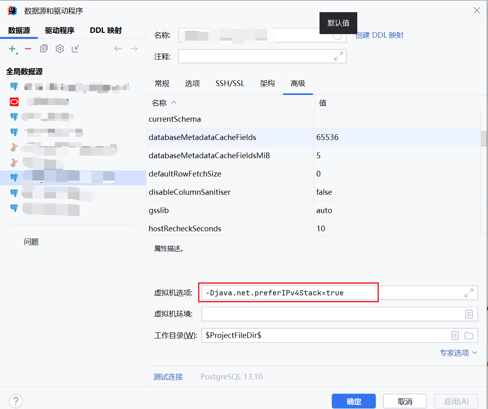

[返回](../)

# PostgreSQL数据库分词版集成说明

* 数据源默认改成PostgreSQL
* 默认集成了PostGIS、zhparser分词
* 分词版本Docker安装方式参考[docker-postgres-12-zhparser-postgis](https://github.com/yoko-murasame/docker-postgres-12-zhparser-postgis)

组件路径: 
* [PG初始化脚本](https://github.com/yoko-murasame/jeecg-boot/blob/yoko-3.4.3last/db/PostgreSQL)

修改历史:
* 2023-07-18: 添加分词功能PostgreSQL、各类脚本。
* 2023-07-20: 添加完整数据库部署教程。

## PostgreSQL分词版本数据库安装和导入完整步骤

### 1）安装

1.1）安装Docker，参考[Docker安装](https://docs.docker.com/engine/install/)

1.2）安装Git，clone下面仓库
```shell
git clone https://github.com/yoko-murasame/docker-postgres-12-zhparser-postgis.git
```

1.3）修改Dockfile中的pg版本号（默认为12），找到`ARG pg_version=12`改成12、13、14等版本号（目前用过12、13）

1.4）执行构建（最好有外网代理环境，防止某些lib库下载失败）
```shell
docker build -t postgres-13-zhparser-postgis:1.0 .
```

1.5）导出镜像文件，再导入到服务器（服务器没有外网）
```shell
# 导出镜像
docker save -o postgres-13-zhparser-postgis-v1 postgres-13-zhparser-postgis:1.0
# 加载镜像
docker load -i postgres-13-zhparser-postgis-v1
````

1.6）启动容器
```shell
# 创建存放数据目录
mkdir -p /root/pgdata
# 启动容器
docker run -d \
  --name postgre-13 \
	-e POSTGRES_PASSWORD=123456 \
	-e PGDATA=/var/lib/postgresql/data/pgdata \
	-p 54321:5432 \
	-v /root/pgdata:/var/lib/postgresql/data/pgdata \
	postgres-13-zhparser-postgis:1.0;
````

1.7）开放远程，开放防火墙端口
```shell
#############################################
# 修改远程配置，修改 postgresql.conf
#############################################
- listen_addresses = 'localhost'
+ listen_addresses = '*'
#############################################
# 修改 pg_hba.conf
#############################################
# "local" is for Unix domain socket connections only
local   all             all                                     md5
# IPv4 local connections:
host    all             all             127.0.0.1/32            md5
host    all             all             0.0.0.0/0            md5
# IPv6 local connections:
host    all             all             ::1/128                 md5
host    all             all             ::/0                 md5
# Allow replication connections from localhost, by a user with the
# replication privilege. # 复制权限（可以不配置）
local   replication     all                                     md5
host    replication     all             127.0.0.1/32            md5
host    replication     all             0.0.0.0/0            md5
host    replication     all             ::1/128                 md5
host    replication     all             ::/0                 md5
# 其实最下面加一行这个就可以了
host all all all md5
#############################################
# 重启数据库
docker restart postgre-13
# 开放防火墙
firewall-cmd --zone=public --add-port=54321/tcp --permanent && firewall-cmd --reload
```

### 2）导入导出数据库

2.1）导出已有的数据库文件（可选）；如果是第一次初始化请用这个：[PostgreSQL初始化数据库备份文件](https://github.com/yoko-murasame/jeecg-boot/blob/yoko-3.4.3last/db/PostgreSQL/backup.dump)
```shell
# 进入容器执行备份
docker exec -it <容器> pg_dump -h <主机名> -p <端口号> -U <用户名> -W -Fc -f /backup.dump -d <数据库名称>
# 复制备份到宿主机
docker cp <容器>:/backup.dump /root/pgbackup/backup.dump
# 非Docker安装方式的备份导出示例
# pg_dump -h localhost -p 54321 -U postgres -W -Fc -f ./backup.dump -d postgres
````

2.2）导入数据库备份文件
```shell
# 导入到数据库注意需要先创建数据库
psql -U <用户名> -h <主机名> -p <端口号>
CREATE DATABASE <目标数据库名称>;
# 复制备份到新的容器
docker cp /root/pgbackup/backup.dump <容器>:/backup.dump
# 可选参数
# --data-only 只恢复数据，而不恢复表模式
# --clean 创建数据库对象前先清理(删除)它们
# --create 在恢复数据库之前先创建它。如果也声明了--clean， 那么在连接到数据库之前删除并重建目标数据库
docker exec -it <新容器> pg_restore --verbose --clean --create -h <主机名> -p <端口号> -U <用户名> -W -d <目标数据库名称> <容器内备份文件路径>

# 补充：如果导出的PG备份SQL文件怎么还原？通过psql导入，在cmd中执行下面命令：最后的 '<' 可以换成 '-f'
docker exec -it <新容器> psql -h <主机名> -p <端口号> -U <用户名> -W -d <目标数据库名称> < ./backup.sql

# 其他运维命令（关闭数据库链接、删除数据库等）
psql -U <用户名> -h <主机名> -p <端口号> -d <数据库名称>
# 查找数据库活动连接
SELECT * FROM pg_stat_activity WHERE datname='<数据库名称>';
# 关闭数据库连接
SELECT pg_terminate_backend(<pid>);
# 删除数据库
DROP DATABASE <数据库名称>;
# 查看存在的数据库列表 \l
SELECT datname FROM pg_database;
```

### 3）必须执行的脚本

3.1）[特殊报错处理](https://github.com/yoko-murasame/jeecg-boot/blob/yoko-3.4.3last/db/PostgreSQL/特殊报错处理.sql)

3.2）[分词启用脚本](https://github.com/yoko-murasame/jeecg-boot/blob/yoko-3.4.3last/db/PostgreSQL/分词启用脚本.sql)

### 4）其他说明

4.1）act_开头的表为activity的表，不存在时会默认自动创建，**建议删除导入后的备份表然后启动后端自动重建**。

4.2）qrtz_开头的表为quartz的表，可以自动创建，**如果想删除导入后的备份然后自动创建，需要开启下面配置：**
```yaml
spring:
  ## quartz定时任务,采用数据库方式
  quartz:
    jdbc:
      #第一次启动时建议清除所有qrtz_表然后使用always配置建表，第二次启动时建议使用never或embedded配置
      initialize-schema: always # EMBEDDED
```

## 扩展

### 性能优化
在线性能优选参数生成器：https://pgtune.leopard.in.ua/

Github项目地址：https://github.com/le0pard/pgtune

获取Linux服务器的性能配置，涉及以下指标
```shell
# CPU逻辑核心数
lscpu | grep "^CPU(s):" | head -1 | awk '{print $2}'
# 查看内存大小
free -h
# 查看硬盘是否是SSD 如果 RoTa 值为 1，说明硬盘是旋转的机械硬盘（HDD）；如果 RoTa 值为 0，说明硬盘是固态硬盘（SSD）
lsblk -d -o name,rota
```

### 数据备份和还原
```shell
# 进入容器执行备份
docker exec -it <容器> pg_dump -h localhost -p 5432 -U postgres -W -Fc -f /backup.dump -d <database>
# 复制备份到宿主机
docker cp <容器>:/backup.dump /root/pgbackup/backup.dump
# 复制备份到新的容器
docker cp /root/pgbackup/backup.dump <容器>:/backup.dump
# 导入到数据库方式，注意需要先创建数据库
psql -U <用户名> -h <主机名> -p <端口号>
CREATE DATABASE <目标数据库名称>;
docker exec -it <新容器> pg_restore --verbose -U postgres -W -d <目标数据库名称> <容器内备份文件路径>
# 补充：如果导出的PG备份SQL文件怎么还原？通过psql导入，在cmd中执行下面命令：
docker exec -it <新容器> psql -h <主机名> -p <端口号> -U <用户名> -W -d <目标数据库名称> < ./backup.sql
# 也可以-f指定
docker exec -it <新容器> psql -h <主机名> -p <端口号> -U <用户名> -W -d <目标数据库名称> -f <容器内备份文件路径>
```


### Linux备份脚本
```shell
#!/bin/bash

# 备份目录
BACKUP_DIR="/pgbackup/"
# 保留的备份文件数量
KEEP_COUNT=7
# 用户密码
username=postgres
password=123456
# HOST
HOSTNAME=localhost
PORT=54321
# 数据库名称
DB_NAME=gongyong_test
# pg_dump 命令路径
PG_DUMP="docker exec -it postgis pg_dump"

# 日期格式，用于命名备份文件
DATE=$(date +%Y%m%d)
# 备份文件名
BACKUP_FILE="${DB_NAME}_${DATE}.dump"

# 导出数据库
PGPASSWORD=${password} ${PG_DUMP} -h ${HOSTNAME} -p ${PORT} -U ${username} -Fc -f ${BACKUP_DIR}/${BACKUP_FILE} ${DB_NAME}

# 检查备份文件是否存在
if [ -f "${BACKUP_DIR}/${BACKUP_FILE}" ]; then
    echo "备份成功: ${BACKUP_DIR}/${BACKUP_FILE}" >> backup.log
else
    echo "备份失败: ${BACKUP_DIR}/${BACKUP_FILE}"  >> backup.log
fi

# 清理的文件名前缀
BACKUP_PREFIX="${DB_NAME}_"

# 遍历备份目录下所有以 BACKUP_PREFIX 开头的文件，并按修改时间排序
files=($(find "$BACKUP_DIR" -maxdepth 1 -name "${BACKUP_PREFIX}*.dump" -printf "%T@ %p\n" | sort -n | cut -d' ' -f2-))

# 如果备份文件数量大于 KEEP_COUNT，则删除除了最新的 KEEP_COUNT 个文件之外的所有文件
count=${#files[@]}
if [[ $count -gt $KEEP_COUNT ]]; then
    echo "保存最近 $KEEP_COUNT 个备份" >> backup-clean.log
    for ((i=0; i<count-KEEP_COUNT; i++))
    do
        echo "删除备份 ${files[i]}" >> backup-clean.log
        rm "${files[i]}"
    done
else
    echo "备份文件数量 (${#files[@]}) 小于等于 $KEEP_COUNT, 不执行清理操作." >> backup-clean.log
fi

```

### Windows备份脚本
```cmd
echo Do backing...please waiting....
@echo off

set KEEP_NUMBER=7
set BACKUP_DIR=.
set DB_NAME=postgres
set HOSTNAME=localhost
set PORT=54321
set USERNAME=postgres
set PASSWORD=123456

set PG_DUMP="C:\Program Files\PostgreSQL\13\bin\pg_dump.exe"

set /A KEEP_INDEX=%KEEP_NUMBER%-1
for /f "skip=%KEEP_INDEX% delims=" %%F in ('dir /b *.backup /o-d') do del "%BACKUP_DIR%\%%F"

set CUR_DATE=%date:~0,4%-%date:~5,2%-%date:~8,2%
set CUR_TIME=%time:~0,2%%time:~3,2%%time:~6,2%
set BACKUP_FILE=%BACKUP_DIR%\%DB_NAME%_%CUR_DATE%_%CUR_TIME%.backup

SET PGPASSWORD=%PASSWORD%

%PG_DUMP% -h %HOSTNAME% -p %PORT% -U %USERNAME% -Z 9 -Fc -f %BACKUP_FILE% %DB_NAME%

```

## 归档

### PostgreSQL分词版本安装说明(基于Docker)
```shell
# 先去把上面的仓库clone下来
git clone https://github.com/yoko-murasame/docker-postgres-12-zhparser-postgis.git
# 修改pg版本号 找到 ARG pg_version=12 改成12、13、14等版本号（目前测试过12、13）
vim Dockfile
# 执行构建
docker build -t postgres-13-zhparser-postgis:1.0 .
# 导出镜像
docker save -o postgres-13-zhparser-postgis-v1 postgres-13-zhparser-postgis:1.0
# 加载镜像
docker load -i postgres-13-zhparser-postgis-v1
# 首次启动
docker run -d \
  --name postgre-13 \
	-e POSTGRES_PASSWORD=123456 \
	-e PGDATA=/var/lib/postgresql/data/pgdata \
	postgres-13-zhparser-postgis:1.0;
# 复制data目录出来
docker cp postgre-13:/var/lib/postgresql/data/pgdata /root/pgdata
# 启动容器
docker run -d \
  --name postgre-13 \
	-e POSTGRES_PASSWORD=123456 \
	-e PGDATA=/var/lib/postgresql/data/pgdata \
	-p 54321:5432 \
	-v /root/pgdata:/var/lib/postgresql/data/pgdata \
	postgres-13-zhparser-postgis:1.0;
#############################################
# 修改远程配置，修改 postgresql.conf
#############################################
- listen_addresses = 'localhost'
+ listen_addresses = '*'
#############################################
# 如果是Windows的pgdata目录迁移到Linux的pgdata，下面的内存类型得修改
#############################################
dynamic_shared_memory_type = posix	# the default is the first option
					# supported by the operating system:
					#   posix
					#   sysv
					#   windows Windows版本的默认就是windows
					#   mmap
					# (change requires restart)
#############################################
# 修改 pg_hba.conf
#############################################
# "local" is for Unix domain socket connections only
local   all             all                                     md5
# IPv4 local connections:
host    all             all             127.0.0.1/32            md5
host    all             all             0.0.0.0/0            md5
# IPv6 local connections:
host    all             all             ::1/128                 md5
host    all             all             ::/0                 md5
# Allow replication connections from localhost, by a user with the
# replication privilege. # 复制权限（可以不配置）
local   replication     all                                     md5
host    replication     all             127.0.0.1/32            md5
host    replication     all             0.0.0.0/0            md5
host    replication     all             ::1/128                 md5
host    replication     all             ::/0                 md5
# 其实最下面加一行这个就可以了
host all all all md5
#############################################
# 重启数据库
docker restart postgre-13
# 防火墙
firewall-cmd --zone=public --add-port=54321/tcp --permanent
firewall-cmd --zone=public --remove-port=8080/tcp --permanent
firewall-cmd --reload
firewall-cmd --list-ports
```

### 分词功能
```sql
-- 进入容器
docker exec -it <container> bash
-- 连接psql
psql -U postgres -h 127.0.0.1
-- 如果需要创建数据库
psql -d <database>;
-- 查看数据库列表
\l
-- 选择进入数据库
\c <database>
-- 为数据库执行分词脚本，见下文

-- 执行脚本 BEGIN --
-- 创建分词扩展
CREATE EXTENSION zhparser;
CREATE TEXT SEARCH CONFIGURATION chinese (PARSER = zhparser);
ALTER TEXT SEARCH CONFIGURATION chinese
    ADD MAPPING FOR a,b,c,d,e,f,g,h,i,j,k,l,m,n,o,p,q,r,s,t,u,v,w,x,y,z
        WITH simple;
-- 新创建的库会自动执行下面的步骤，等待一会儿就行
-- 1.创建模式zhparser
-- 2.创建分词函数
-- 执行脚本 END --


-- 测试
SELECT to_tsvector('chinese', '人生苦短，乘早摸鱼，Good Morning~');
                      to_tsvector
--------------------------------------------------------
'good':8 'morning':9 '乘':4 '人生':1 '摸':6 '早':5 '短':3 '苦':2 '鱼':7

-- 添加自定义词典
insert into zhparser.zhprs_custom_word values ('摸鱼');
insert into zhparser.zhprs_custom_word values ('荒天帝');
insert into zhparser.zhprs_custom_word values ('独断万古');
insert into zhparser.zhprs_custom_word values ('人生苦短');
-- 词典生效
select sync_zhprs_custom_word();

-- test
SELECT * FROM ts_parse('zhparser', '人生苦短，爆炸吧，小宇宙，独断万古荒天帝，摸鱼ing，Good Morning~');
SELECT to_tsquery('chinese', '荒天帝石昊');
SELECT to_tsvector('chinese', '人生苦短，爆炸吧，小宇宙，独断万古荒天帝，摸鱼ing，Good Morning~');
```

### 特殊问题记录

1）[使用EasyConnect后，用navicat可以访问数据库，但是用Idea跑项目连接超时怎么办](https://blog.csdn.net/qq_32447361/article/details/121862199)

解决：添加jvm参数`-Djava.net.preferIPv4Stack=true`

