# Jeecg单体升级微服务3.4

> Version: 3.4以上版本 | 20220806
>
> **3.4+重大升级说明**
>
> - 升级[Spring Cloud Alibaba 2021.0.1.0](https://github.com/alibaba/spring-cloud-alibaba/blob/2021.x/spring-cloud-alibaba-docs/src/main/asciidoc-zh/sca-upgrade-guide.adoc)，使用 spring.config.import 方式引入nacos配置
> - 拆分jeecg-boot-starter出来，使用独立项目维护 [jeecg-boot-starter项目新地址](https://gitee.com/jeecg/jeecg-boot-starter)

- [单体升级微服务](https://www.kancloud.cn/zhangdaiscott/jeecg-boot/3043475#_0)

- - [一、配置host](https://www.kancloud.cn/zhangdaiscott/jeecg-boot/3043475#host_12)

  - [二、勾选中Maven Profile `dev和SpringCloud`](https://www.kancloud.cn/zhangdaiscott/jeecg-boot/3043475#Maven_Profile_devSpringCloud_26)

  - [三、创建微服务所需数据库](https://www.kancloud.cn/zhangdaiscott/jeecg-boot/3043475#_33)

  - [四、启动微服务项目](https://www.kancloud.cn/zhangdaiscott/jeecg-boot/3043475#_44)

  - - [4.1 启动`nacos`](https://www.kancloud.cn/zhangdaiscott/jeecg-boot/3043475#41_nacos_46)
    - [4.2 启动`jeecg-demo`服务](https://www.kancloud.cn/zhangdaiscott/jeecg-boot/3043475#42_jeecgdemo_57)
    - [4.3 启动`jeecg-system`服务](https://www.kancloud.cn/zhangdaiscott/jeecg-boot/3043475#43_jeecgsystem_63)
    - [4.4 启动网关`gateway`](https://www.kancloud.cn/zhangdaiscott/jeecg-boot/3043475#44_gateway_75)
    - [4.5 启动更多服务模块](https://www.kancloud.cn/zhangdaiscott/jeecg-boot/3043475#45__90)

  - [五-1、Vue2前端对接 (ant-design-vue-jeecg)](https://www.kancloud.cn/zhangdaiscott/jeecg-boot/3043475#1Vue2_antdesignvuejeecg_141)

  - [五-2、Vue3前端对接 (jeecgboot-vue3)](https://www.kancloud.cn/zhangdaiscott/jeecg-boot/3043475#2Vue3_jeecgbootvue3_148)

  - [六、深入高级功能](https://www.kancloud.cn/zhangdaiscott/jeecg-boot/3043475#_156)

  - - [6.1. rabbitmq服务启动](https://www.kancloud.cn/zhangdaiscott/jeecg-boot/3043475#61_rabbitmq_158)
    - [6.2. xxljob服务启动](https://www.kancloud.cn/zhangdaiscott/jeecg-boot/3043475#62_xxljob_165)

*示例：将模块 system、demo ，快速切换成 SpringCloud微服务启动*

## 一、配置host

> 提醒：必须配置，不然启动会报错。

```
127.0.0.1 jeecg-boot-redis
127.0.0.1 jeecg-boot-mysql
127.0.0.1 jeecg-boot-nacos
127.0.0.1 jeecg-boot-gateway
127.0.0.1 jeecg-boot-system
127.0.0.1 jeecg-boot-sentinel
127.0.0.1 jeecg-boot-xxljob
127.0.0.1 jeecg-boot-rabbitmq
```

## 二、勾选中Maven Profile `dev和SpringCloud`

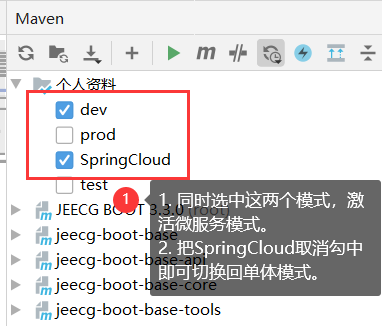
切换成功效果

> 注意：`dev`和`SpringCloud` 需要同时勾选，不然会出错。
> 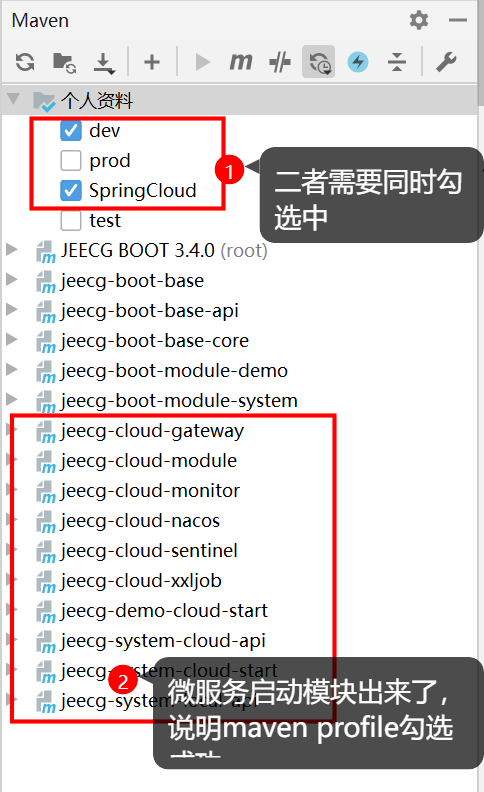

## 三、创建微服务所需数据库

手工执行jeecgboot提供的 [初始化SQL](https://gitee.com/jeecg/tree/master/jeecg-boot/db)，创建`jeecg-boot`、`nacos`、`xxl_job` 三个库。

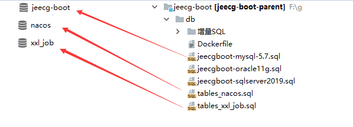

> **重要提示：** nacos库默认加入jeecg所需要配置。
> 如果用自己的nacos，请[ 手工加 jeecg.yaml、jeecg-dev.yaml、jeecg-gateway-dev.yaml等配置](https://gitee.com/jeecg/jeecg-boot/tree/master/jeecg-cloud-module/jeecg-cloud-nacos/docs/config)

## 四、启动微服务项目

### 4.1 启动`nacos`

找到下面的启动类，右键执行

```
项目：jeecg-cloud-module\jeecg-cloud-nacos
启动类：com.alibaba.nacos.JeecgNacosApplication
```

访问：http://localhost:8848/nacos
账号密码：nacos/nacos

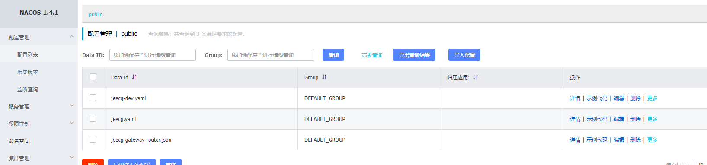

### 4.2 启动`jeecg-demo`服务

找到下面的启动类打开注释，右键启动

```
项目：jeecg-cloud-module/jeecg-demo-cloud-start
启动类：org.jeecg.JeecgDemoCloudApplication
```

### 4.3 启动`jeecg-system`服务

1 找到下面的启动类，右键启动

```
项目：jeecg-cloud-module/jeecg-system-cloud-start
启动类：org.jeecg.JeecgSystemCloudApplication
```

2 单体启动类可以删掉或者注释掉

```
jeecg-boot-module-system/src/main/java/org/jeecg/JeecgSystemApplication.java
```

### 4.4 启动网关`gateway`

- 找到下面的启动类，右键启动

```
项目：jeecg-cloud-module\jeecg-cloud-gateway
启动类：org.jeecg.JeecgGatewayApplication
```

- 所有服务启动效果
  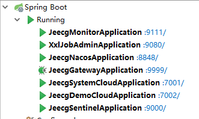
- 访问gateway看接口文档
  [http://localhost:9999](http://localhost:9999/)
  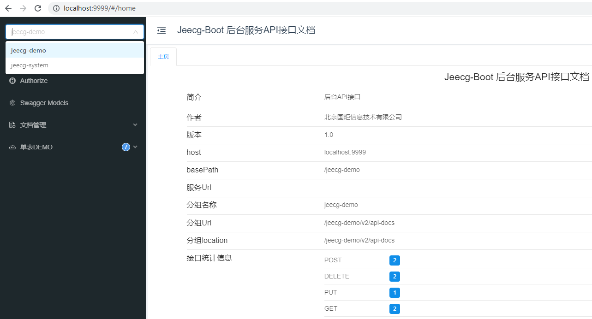

### 4.5 启动更多服务模块

> 跟上面类同，这里不做详细介绍了。

Xxljob服务端

```
 项目：jeecg-cloud-module\jeecg-cloud-xxljob
 启动类：src\main\java\com\xxl\job\admin\XxlJobAdminApplication.java
  
- 访问：http://localhost:9080/xxl-job-admin
- 账号：admin/123456
```

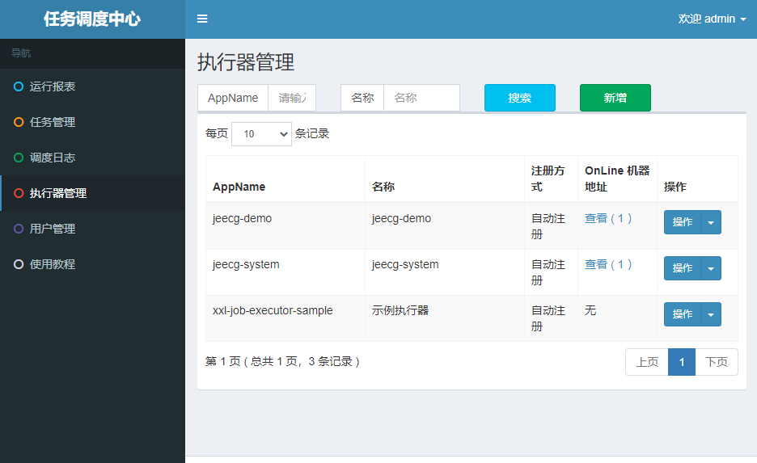

Sentinel服务端

```
项目： jeecg-cloud-module\jeecg-cloud-sentinel
启动类：src\main\java\com\alibaba\csp\sentinel\dashboard\JeecgSentinelApplication.java

-访问：http://localhost:9000
-账号密码：sentinel/sentinel
```

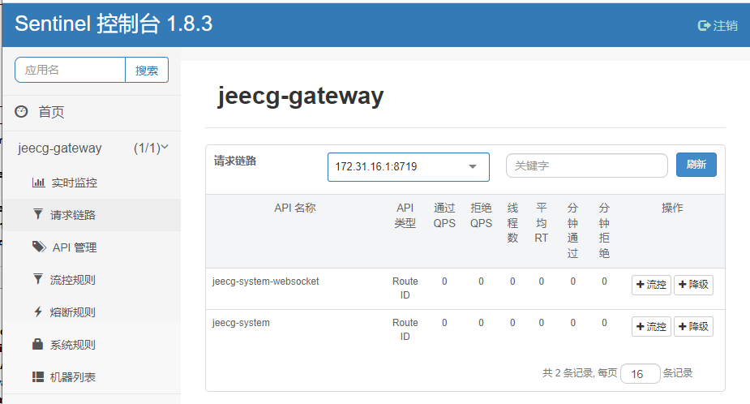

SpringBoot Admin服务监控

```
项目：jeecg-cloud-module\jeecg-cloud-monitor
启动类：src\main\java\org\jeecg\monitor\JeecgMonitorApplication.java 

- 访问：http://localhost:9111/login
- 账号：admin/admin
```

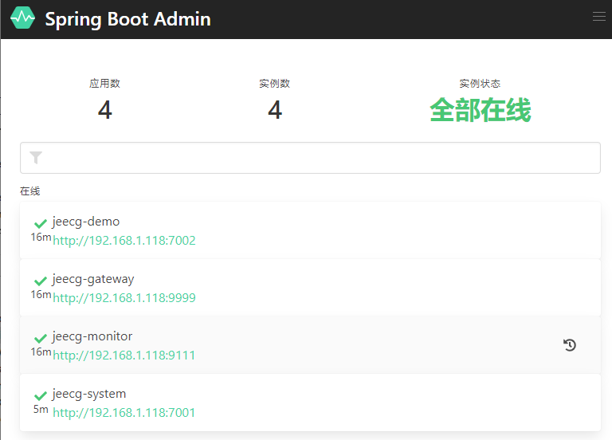

**特殊配置**

- 默认是关闭了xxljob，需要启动请修改`nacos`中`jeecg-dev.yaml`中的属性
  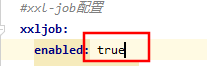
- Sentinel已做了深度改造，支持持久化配置到nacos中
- 微服务做了很多示例，需要请打开`jeecg-cloud-system-start`项目`pom.xml`注释
- 另外测试MQ需要 [安装rabitmq服务](https://www.kancloud.cn/zhangdaiscott/jeecg-boot/2043897)、测试seata也需要 [安装服务端](https://www.kancloud.cn/zhangdaiscott/jeecg-boot/2593658)
- 更多微服务文档： [Sentinel限流熔断降级](https://www.kancloud.cn/zhangdaiscott/jeecg-boot/2350293) | [分库分表文档](https://www.kancloud.cn/zhangdaiscott/jeecg-boot/2595023) | [分布式锁](https://www.kancloud.cn/zhangdaiscott/jeecg-boot/2043896) | [消息总线](https://www.kancloud.cn/zhangdaiscott/jeecg-boot/2043899)

**其他服务测试地址**

| 软件服务                            | 测试地址                                          | 账号密码          | 是否必须 |
| :---------------------------------- | :------------------------------------------------ | :---------------- | :------- |
| nacos（服务注册发现和统一配置中心） | http://localhost:8848/nacos                       | nacos/nacos       | 是       |
| rabitmq （消息中间件）              | [http://localhost:15672](http://localhost:15672/) | guest/guest       | 否       |
| xxl-job-admin（分布式定时任务）     | http://localhost:9080/xxl-job-admin               | admin/123456      | 否       |
| sentinel （Sentinel监控）           | [http://localhost:9000](http://localhost:9000/)   | sentinel/sentinel | 否       |

## 五-1、Vue2前端对接 (ant-design-vue-jeecg)

修改.env.development，配置接口地址为gateway地址。

```
VUE_APP_API_BASE_URL=http://localhost:9999
```

启动访问： [http://localhost:3000](http://localhost:3000/)

## 五-2、Vue3前端对接 (jeecgboot-vue3)

修改.env.development，配置接口地址为gateway地址。

```
VITE_PROXY = [["/jeecgboot","http://localhost:9999"],["/upload","http://localhost:3300/upload"]]
VITE_GLOB_DOMAIN_URL=http://localhost:9999
```

启动访问： [http://localhost:3100](http://localhost:3100/)

## 六、深入高级功能

### 6.1. rabbitmq服务启动

1、[安装rabbitmq](https://my.oschina.net/jeecg/blog/4729143)
2、修改nacos中jeecg-dev.yaml的rabbitmq链接配置
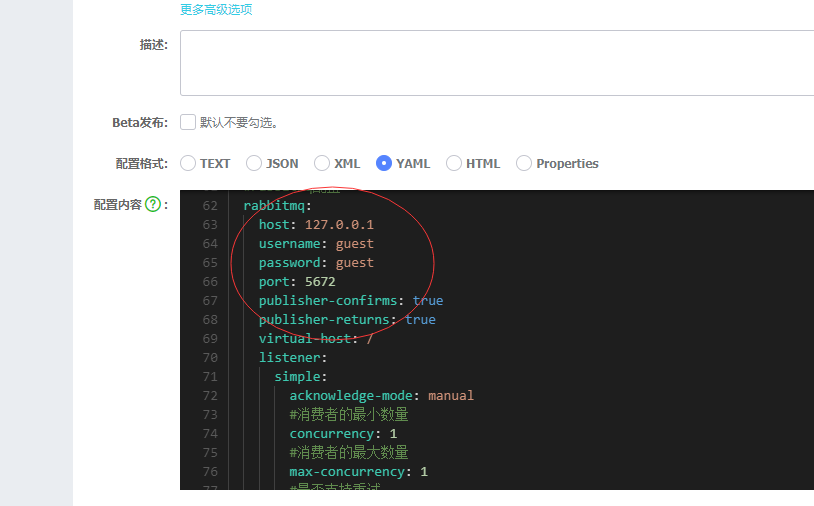
3、启动system，rabbitmq队列和交换机会自动生成
详细文档见[ rabitmq消息队列集成2.4+](http://doc.jeecg.com/2043897)

### 6.2. xxljob服务启动

1. 手工执行脚本[ jeecg-cloud-xxljob/doc/db/tables_xxl_job.sql](https://github.com/zhangdaiscott/jeecg-boot/blob/master/jeecg-boot/jeecg-cloud-module/jeecg-cloud-xxljob/doc/db/tables_xxl_job.sql) 创建xxl_job库
2. xxljob服务启动，请右键执行`jeecg-cloud-xxljob/com.xxl.job.admin.XxlJobAdminApplication`
   详细文档见[ xxl-job定时任务集成2.4+](http://doc.jeecg.com/2043895)