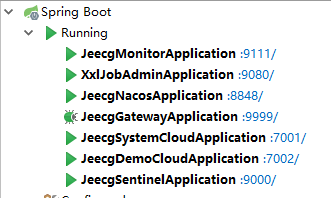
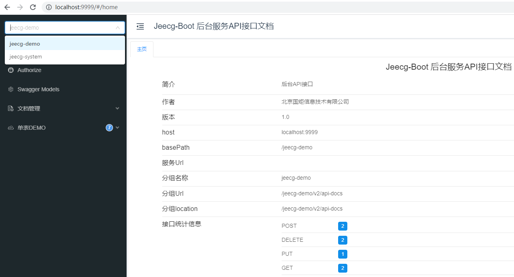
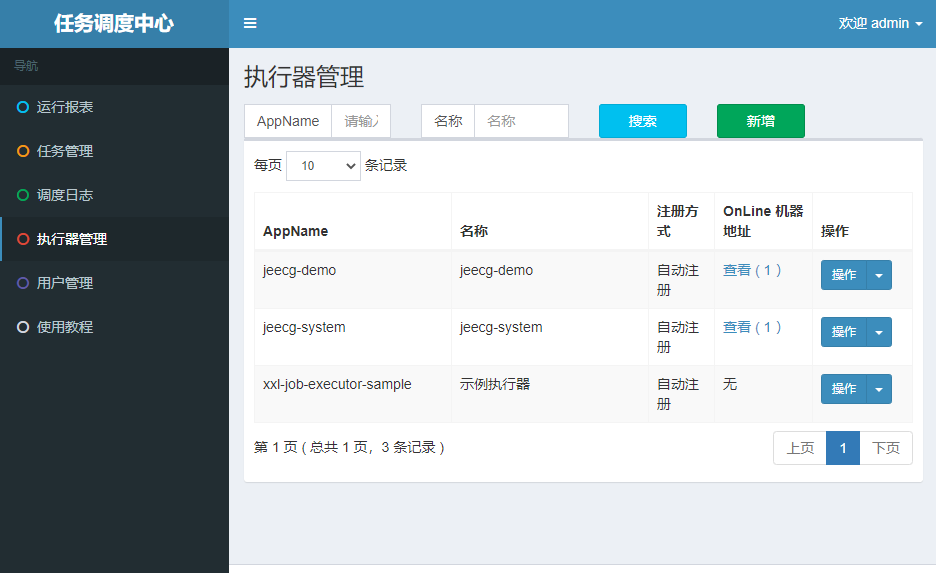
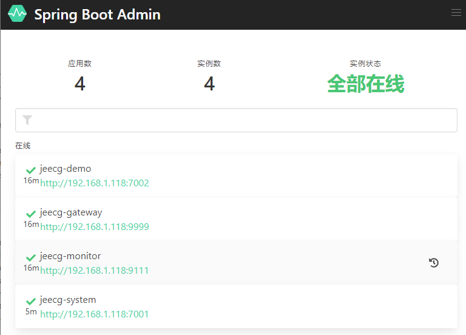

# Jeecg微服务Dubbo版本

## 一、配置host

> 提醒：必须配置，不然启动会报错。

```
127.0.0.1 jeecg-boot-redis
127.0.0.1 jeecg-boot-mysql
127.0.0.1 jeecg-boot-nacos
127.0.0.1 jeecg-boot-gateway
127.0.0.1 jeecg-boot-system
127.0.0.1 jeecg-boot-sentinel
127.0.0.1 jeecg-boot-xxljob
127.0.0.1 jeecg-boot-rabbitmq
```

## 二、勾选中Maven Profile `dev和SpringCloud`


切换成功效果

> 注意：`dev`和`SpringCloud` 需要同时勾选，不然会出错。
> 

## 三、创建微服务所需数据库

手工执行jeecgboot提供的 [初始化SQL](https://gitee.com/jeecg/tree/master/jeecg-boot/db)，创建`jeecg-boot`、`nacos`、`xxl_job` 三个库。


> **重要提示：** nacos库默认加入jeecg所需要配置。
> 如果用自己的nacos，请[ 手工加 jeecg.yaml、jeecg-dev.yaml、jeecg-gateway-dev.yaml等配置](https://gitee.com/jeecg/jeecg-boot/tree/master/jeecg-cloud-module/jeecg-cloud-nacos/docs/config)

## 四、启动微服务项目

### 4.1 启动`nacos`

找到下面的启动类，右键执行

```
项目：jeecg-cloud-module\jeecg-cloud-nacos
启动类：com.alibaba.nacos.JeecgNacosApplication
```

访问：http://localhost:8848/nacos
账号密码：nacos/nacos


### 4.2 启动`jeecg-demo`服务

找到下面的启动类打开注释，右键启动

```
项目：jeecg-cloud-module/jeecg-demo-dubbo-start
启动类：org.jeecg.JeecgDemoDubboApplication
```

### 4.3 启动`jeecg-system`服务

1 找到下面的启动类，右键启动

```
项目：jeecg-cloud-module/jeecg-system-dubbo-start
启动类：org.jeecg.JeecgSystemDubboApplication
```

2 单体启动类可以删掉或者注释掉

```
jeecg-boot-module-system/src/main/java/org/jeecg/JeecgSystemApplication.java
```

3 Windows环境下，让system和demo微服务跑在Docker中，仅提供RPC服务

首先介绍下Dubbo环境变量上下文中4个关键变量；

```shell
# https://cn.dubbo.apache.org/zh-cn/docs/advanced/set-host/
DUBBO_IP_TO_REGISTRY：注册到注册中心的 ip 地址，其他Dubbo微服务通过注册中心的这个地址访问到当前微服务，这里需要设置成当前局域网IP（不要用localhost）
DUBBO_PORT_TO_REGISTRY：注册到注册中心的 port 端口，留空自行选择即可
DUBBO_IP_TO_BIND：监听 ip 地址，这个监听地址必须和nacos注册中心网络连通（一般网段相同，留空自行选择即可，默认会分配Docker的bridge网段ip）
DUBBO_PORT_TO_BIND：监听 port 端口，留空自行选择即可
```

由于Windows环境的Docker不支持Host网络模式，因此我们启动容器时，需要指定变量，容器运行命令参考：

```shell
docker run \
--env=DUBBO_IP_TO_BIND= \
# 局域网网段IP
--env=DUBBO_IP_TO_REGISTRY=192.168.240.72 \
# 这个是配置文件中的环境变量，可以指定端口
--env=DUBBO_PORT=20888 \
--env=DUBBO_PORT_TO_BIND= \
--env=DUBBO_PORT_TO_REGISTRY= \
# Web端口，这个端口在Nacos中注册后还是Docker的bridge网段IP
--env=SERVER_PORT=8001 \
--volume=F:\opt\upFiles:/opt/upFiles:rw \
-p 20888:20888 \
-p 8001:8001 \
--add-host jeecg-boot-nacos:172.17.0.1 \
--add-host jeecg-boot-sentinel:172.17.0.1 \
--add-host jeecg-boot-mysql:172.17.0.1 \
--add-host jeecg-boot-redis:172.17.0.1 \
--add-host jeecg-boot-rabbitmq:172.17.0.1 \
--add-host jeecg-boot-es:172.17.0.1 \
--add-host jeecg-boot-xxljob:172.17.0.1 \
--name=jeecg-system-dubbo -di <镜像名>
```

现在业务微服务工程启动后，可以调用system模块提供的rpc接口了，还有几个问题：

1. 业务微服务启动会报错`Failed to start NettyClient /192.168.240.72 connect to the server /172.17.0.7:20888`，可以看到网段不一致导致的访问问题，但是不影响RPC调用。如果不想要烦人的提示，关闭日志即可（`logging.level.org.apache.dubbo.remoting.exchange.support.header.ReconnectTimerTask: off`）。
2. 启动gateway网关后，会发现无法正常路由到system模块的微服务，这是因为Nacos注册中心的服务名为`jeecg-system-dubbo`的服务绑定的IP还是`172.17.0.7`，因此宿主机上启动的gateway无法路由过去，除非你把gateway也用Docker启动(这样业务微服务中记得把Dubbo的绑定IP统一换成局域网IP)
3. 上述问题只有设置`DUBBO_IP_TO_BIND`才能解决，而Windows下Docker设置后容器无法启动（除非换Linux）


### 4.4 启动网关`gateway`

- 找到下面的启动类，右键启动

```
项目：jeecg-cloud-module\jeecg-cloud-gateway
启动类：org.jeecg.JeecgGatewayApplication
网关配置文件：jeecg-cloud-nacos/docs/config/jeecg-gateway-dev.yaml
```

- 所有服务启动效果
  
- 访问gateway看接口文档
  [http://localhost:9999](http://localhost:9999/)
  

### 4.5 启动更多服务模块

> 跟上面类同，这里不做详细介绍了。

Xxljob服务端

```
 项目：jeecg-cloud-module\jeecg-cloud-xxljob
 启动类：src\main\java\com\xxl\job\admin\XxlJobAdminApplication.java
  
- 访问：http://localhost:9080/xxl-job-admin
- 账号：admin/123456
```



Sentinel服务端

```
项目： jeecg-cloud-module\jeecg-cloud-sentinel
启动类：src\main\java\com\alibaba\csp\sentinel\dashboard\JeecgSentinelApplication.java

-访问：http://localhost:9000
-账号密码：sentinel/sentinel
```


SpringBoot Admin服务监控

```
项目：jeecg-cloud-module\jeecg-cloud-monitor
启动类：src\main\java\org\jeecg\monitor\JeecgMonitorApplication.java 

- 访问：http://localhost:9111/login
- 账号：admin/admin
```



**特殊配置**

- 默认是关闭了xxljob，需要启动请修改`nacos`中`jeecg-dev.yaml`中的属性
  
- Sentinel已做了深度改造，支持持久化配置到nacos中
- 微服务做了很多示例，需要请打开`jeecg-cloud-system-start`项目`pom.xml`注释
- 另外测试MQ需要 [安装rabitmq服务](https://www.kancloud.cn/zhangdaiscott/jeecg-boot/2043897)、测试seata也需要 [安装服务端](https://www.kancloud.cn/zhangdaiscott/jeecg-boot/2593658)
- 更多微服务文档： [Sentinel限流熔断降级](https://www.kancloud.cn/zhangdaiscott/jeecg-boot/2350293) | [分库分表文档](https://www.kancloud.cn/zhangdaiscott/jeecg-boot/2595023) | [分布式锁](https://www.kancloud.cn/zhangdaiscott/jeecg-boot/2043896) | [消息总线](https://www.kancloud.cn/zhangdaiscott/jeecg-boot/2043899)

**其他服务测试地址**

| 软件服务                            | 测试地址                                          | 账号密码          | 是否必须 |
| :---------------------------------- | :------------------------------------------------ | :---------------- | :------- |
| nacos（服务注册发现和统一配置中心） | http://localhost:8848/nacos                       | nacos/nacos       | 是       |
| rabitmq （消息中间件）              | [http://localhost:15672](http://localhost:15672/) | guest/guest       | 否       |
| xxl-job-admin（分布式定时任务）     | http://localhost:9080/xxl-job-admin               | admin/123456      | 否       |
| sentinel （Sentinel监控）           | [http://localhost:9000](http://localhost:9000/)   | sentinel/sentinel | 否       |

## 五-1、Vue2前端对接 (ant-design-vue-jeecg)

修改.env.development，配置接口地址为gateway地址。

```
VUE_APP_API_BASE_URL=http://localhost:9999
```

启动访问： [http://localhost:3000](http://localhost:3000/)

## 五-2、Vue3前端对接 (jeecgboot-vue3)

修改.env.development，配置接口地址为gateway地址。

```
VITE_PROXY = [["/jeecgboot","http://localhost:9999"],["/upload","http://localhost:3300/upload"]]
VITE_GLOB_DOMAIN_URL=http://localhost:9999
```

启动访问： [http://localhost:3100](http://localhost:3100/)

## 六、深入高级功能

### 6.1. rabbitmq服务启动

1、[安装rabbitmq](https://my.oschina.net/jeecg/blog/4729143)
2、修改nacos中jeecg-dev.yaml的rabbitmq链接配置

3、启动system，rabbitmq队列和交换机会自动生成
详细文档见[ rabitmq消息队列集成2.4+](http://doc.jeecg.com/2043897)

### 6.2. xxljob服务启动

1. 手工执行脚本[ jeecg-cloud-xxljob/doc/db/tables_xxl_job.sql](https://github.com/zhangdaiscott/jeecg-boot/blob/master/jeecg-boot/jeecg-cloud-module/jeecg-cloud-xxljob/doc/db/tables_xxl_job.sql) 创建xxl_job库
2. xxljob服务启动，请右键执行`jeecg-cloud-xxljob/com.xxl.job.admin.XxlJobAdminApplication`
   详细文档见[ xxl-job定时任务集成2.4+](http://doc.jeecg.com/2043895)
