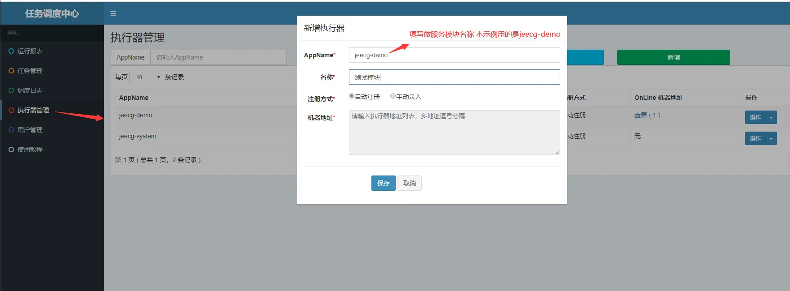
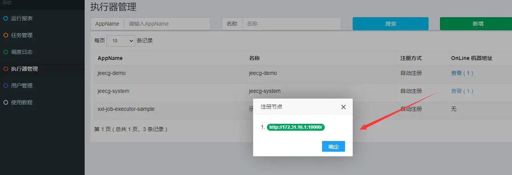
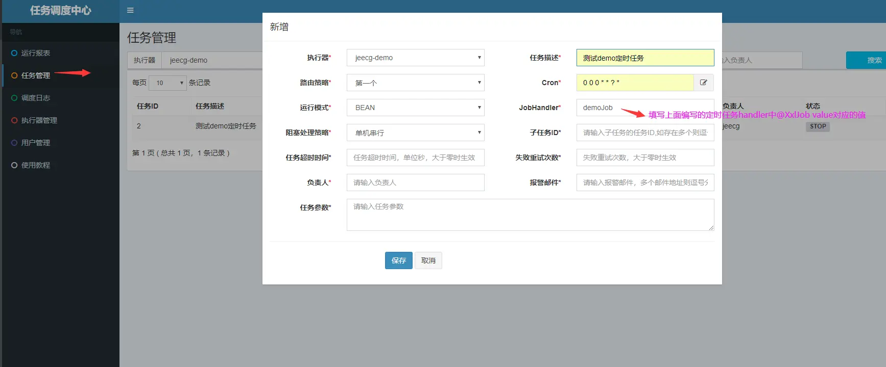

# XxlJob使用说明.md

## 1. 执行：`tables_xxl_job.sql`

## 2. 启动xxl_job服务

文件路径：jeecg-server-cloud/jeecg-visual/jeecg-cloud-xxljob/Dockerfile

```shell
# 打包xxl_job工程的Dockerfile
docker build -t jeecg:xxl_job .
# 启动命令参考
docker run -di --name=jeecg-xxljob \
  -p 9080:9080 \
  -e PORT=9080 \
  -e PROFILE=pg \
  -e DATABASE_HOST=172.17.0.1 \
  -e DATABASE_PORT=5432 \
  -e DATABASE_NAME=xxl_job \
  -e DATABASE_USER=postgres \
  -e DATABASE_PWD=123456 \
 jeecg:xxl_job
# 默认用户名：admin 密码：123456
```

## 3. 微服务模块集成使用

### 3.1 引入依赖

```xml
<!-- 引入定时任务依赖 -->
<dependency>
    <groupId>org.jeecgframework.boot</groupId>
    <artifactId>jeecg-boot-starter-job</artifactId>
</dependency>
```

### 3.2 编写定时任务handler

```java
import com.xxl.job.core.biz.model.ReturnT;
import com.xxl.job.core.handler.annotation.XxlJob;
import lombok.extern.slf4j.Slf4j;
import org.springframework.stereotype.Component;

@Component
@Slf4j
public class DemoJobHandler {

    @XxlJob(value = "demoJob")
    public ReturnT<String> demoJobHandler(String params) {
        log.info("我是定时任务,我执行了...............................");
        return ReturnT.SUCCESS;
    }
}
```

### 3.3 修改nacos中jeecg-dev.yaml配置，开启 xxljob

```yaml
jeecg:
  xxljob:
    enabled: true
    adminAddresses: http://jeecg-boot-xxljob:9080/xxl-job-admin
    appname: ${spring.application.name}
    accessToken: ''
    logPath: logs/jeecg/job/jobhandler/
    logRetentionDays: 30
```

### 3.4 访问xxl管理后台

http://jeecg-boot-xxljob:9080/xxl-job-admin

默认登录账号：admin/123456

创建定时任务：

1. 新增执行器(对应微服务名，需要手工创建)



2. 查看注册节点，填写微服务名后，过一会儿后就会自动出现



3. 新增定时任务



